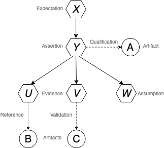
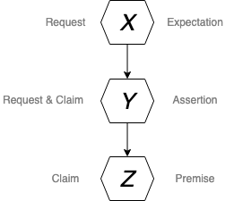
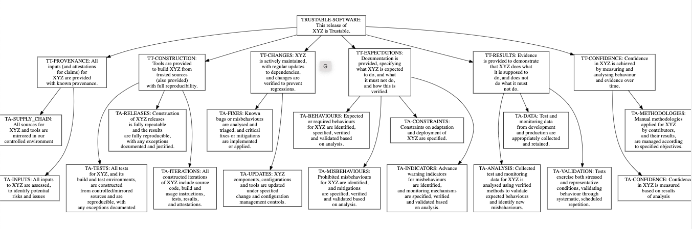

# 🧩 Trustable Software Framework (TSF) — Overview and Implementation

## 1. What is TSF (Trustable Software Framework)

“TSF specifies how metadata about a software project is stored and managed in a git repository, alongside the software’s source code and documentation.”
📘 Official source (GitLab project): https://www.codethink.co.uk/trustable-software-framework.
https://projects.eclipse.org/projects/technology.tsf 

The Trustable Software Framework (TSF) is an open-source toolset designed to manage requirements, evidence, and verification activities for safety- and mission-critical software — especially in aerospace, defense, automotive, and medical domains, where the software must be demonstrably trustworthy.

The **Eclipse Trustable Software Framework (TSF)** is a **model and methodology to assess the "trustability" of software**, based on **verifiable evidence** of how it is developed, tested, and maintained.

Instead of relying on Word documents, Excel sheets, or proprietary requirements tools, TSF integrates **trust metadata directly into the project's Git repository** (alongside code, documentation, and tests).

TSF focuses on **critical systems**—where **security, performance, availability, and reliability** are essential—and allows you to:
- **Track expectations and evidence** (who guarantees what and based on which proofs);
- **Quantify trust** (via scores);
- **Maintain consistency** between what the software claims to do and what it actually does.

### TSF Scaffolding

In the Trustable Software Framework (TSF), **scaffolding** refers to the minimal project structure required to apply TSF methodology.

#### Components of TSF Scaffolding

1. **Statements**  
   - Expectations, Assertions, and Assumptions
   - Stored as individual Markdown files (`.md`) in the repository
   - Example from docs:  
     > “Statements are stored as markdown files that are uniquely named within a project's git repository.” — GitLab

2. **Links Graph**  
   - Represents relationships between Statements (which item supports another)
   - Stored in `.dotstop.dot` (a directed graph / DAG)
   - Example from docs:  
     > “The links between items are stored in a .dot file, .dotstop.dot, which is placed in the top-level of a project's git repository.”

3. **Configuration / Frontmatter**  
   - Metadata in each `.md` file
   - Includes: normative, evidence, references, score, etc.

4. **Tool Workflow (trudag)**  
   - Manages creation, linking, scoring, and publishing of the traceability graph
   - Ensures consistency and automation

#### Summary

Scaffolding = **Markdown files + DOT graph + metadata + trudag workflow**

- Without scaffolding, TSF methodology cannot be applied
- Provides a reproducible structure for traceability and automated scoring

### Current Status

- TSF is **incubated at the Eclipse Foundation**, with **active development by Codethink**.  
- It is **open source**, licensed under **EPL 2.0** and **CC BY-SA 4.0**.  
- Main development occurs on Codethink's GitLab:  
  👉 [https://gitlab.com/CodethinkLabs/trustable/trustable](https://gitlab.com/CodethinkLabs/trustable/trustable)
- The **official tooling** is **TruDAG** (Trustable Directed Acyclic Graph tool), implemented in Python.  
- The model is based on **Directed Acyclic Graphs (DAGs)** composed of **Statements** linked by logical relationships.

### 🧩 1.1. Trustable Software Framework (TSF) — Overview and Technical Context

📚 Official source (GitLab Project)

“Trustable Software Framework (TSF) builds on top of Doorstop to manage requirements, tests, and assurance cases in a traceable, verifiable way.”
👉 Source: https://gitlab.com/trustable/trustable

In short:

- TSF extends Doorstop to provide full traceability and certification evidence management.

### ⚙️ 1.2. What is Doorstop

- Doorstop is the foundation of TSF.
- It’s a Python-based tool that uses YAML files to represent requirements, tests, and documentation in a version-controlled and traceable way.

📘 Official source (Doorstop README):

“Doorstop is a requirements management tool that stores data in version control alongside source code.”
👉 Source: https://github.com/doorstop-dev/doorstop

💡 Instead of using Word or Excel, each requirement is a small .yaml file stored next to your source code in Git.
This makes it possible to link requirements, implementation, and verification directly.

📘 Official source (GitLab project)

“Trustable Software Framework (TSF) builds on top of Doorstop to manage requirements, tests, and assurance cases in a traceable, verifiable way.”
👉 Source: https://gitlab.com/trustable/trustable

### 🧠 1.3. What is trudag

- trudag is the command-line interface (CLI) included with the trustable package.
- It’s used to generate traceability diagrams and documents from TSF repositories.

- It converts relationships between requirements and tests into .dot files (Graphviz format), which can later be exported as PDF or PNG to visualize traceability.

📗 Official source (Trustable CLI docs):

“The trudag CLI builds traceability diagrams (.dot files) from TSF repositories.”
👉 Source: https://gitlab.com/trustable/trustable/-/tree/main/frontends/cli

### 🔷 1.4. What are .dot files

The extension .dot comes from the Graphviz DOT language (comes and uses), a language (plain text graph description) that is used to describe grafs (nodes and connections).

📚 Official source (Graphviz):

“The DOT language is a plain text graph description language.”
👉 https://graphviz.org/doc/info/lang.html

💡 In TSF, DOT files are used to visualize relationships like:

[REQ-001] --> [TEST-001]

#### This enables automatic generation of traceability diagrams for:

- Requirements
- Tests
- Verification activities
- Certification evidence

#### Why TSF Uses a `.dotstop.dot` File

The `.dotstop.dot` file is central to TSF for several reasons:

1. **Represents a directed graph (DAG) between Statements**
   - Links define logical support relationships:  
     > “Statements are connected by Links. A Link from Statement A to Statement B means that Statement A logically implies Statement B.”
   - Source: Codethink Labs TSF documentation

2. **Standardized graph format**
   - DOT language (Graphviz)
   - `.dotstop.dot` is a strict subset of DOT:
     > “trudag uses a strict subset of the DOT language … the .dot file `.dotstop.dot`”

3. **Visualization and analysis**
   - Can be visualized using Graphviz, networkx, Gephi, etc.
   - Enables identification of:
     - Dependencies
     - Suspect links
     - Items without evidence

#### Example of `.dotstop.dot`

```bash
digraph Trustable {
    // Metadata (optional)
    rankdir=LR;
    label="Trustable DAG"; 
    node [shape=box, style=filled, color=lightgrey];

    // Statement nodes (each .md)
    "CAR-EXPECTED_LANE_KEEPING" [label="Expectation: Keep lane within ±0.3m"];
    "CAR-LANE_KEEPING_TESTS" [label="Evidence: Simulation and track tests"];
    "CAR-ASSUMPTIONS" [label="Assumption: Road lines visible under daylight"];

    // Links between Statements
    "CAR-LANE_KEEPING_TESTS" -> "CAR-EXPECTED_LANE_KEEPING";
    "CAR-ASSUMPTIONS" -> "CAR-EXPECTED_LANE_KEEPING";
}
```

| Line                                                       | Meaning                                                           | Source / Doc                                               |
| ---------------------------------------------------------- | ----------------------------------------------------------------- | ---------------------------------------------------------- |
| `digraph Trustable {`                                      | Starts a directed graph. Each link has a direction (A supports B) | Codethink Labs TSF docs                                    |
| `rankdir=LR;`                                              | Layout left-to-right for easier reading                           | DOT standard                                               |
| `"CAR-EXPECTED_LANE_KEEPING" ...`                          | Defines a Statement (Expectation) as a node                       | Statements stored as Markdown                              |
| `"CAR-LANE_KEEPING_TESTS" ...`                             | Node representing Evidence                                        | Same as above                                              |
| `"CAR-ASSUMPTIONS" ...`                                    | Node representing Assumption                                      | Same as above                                              |
| `"CAR-LANE_KEEPING_TESTS" -> "CAR-EXPECTED_LANE_KEEPING";` | Link: Evidence supports Expectation                               | TSF doc: “A Link from A to B means A logically implies B.” |
| `"CAR-ASSUMPTIONS" -> "CAR-EXPECTED_LANE_KEEPING";`        | Link: Assumption supports Expectation                             | Same                                                       |


- Practical Usage
. trudag manage show-link CAR-EXPECTED_LANE_KEEPING
. trudag publish --figures

Generates a visual graph (Graphviz PDF/PNG) showing support relationships.

### 1.5. What is a Graph (in TSF context)

A graph is a set of nodes connected by edges:

- Each node is a Statement (a claim about the software).
- Each edge is a logical link, meaning “this leads to that” or “this depends on that”.

----

### 1.6. Directed Acyclic Graph - TSF uses a DAG (Directed Acyclic Graph):

- Directed → edges have direction (A supports B).
- Acyclic → no cycles allowed (A cannot depend on itself indirectly).

💡 Simple analogy:
Imagine a family tree: each person (Statement) is linked to parents/children. No one can be their own ancestor → no cycles.


## Why TSF Uses a `.dotstop.dot` File

The `.dotstop.dot` file is central to TSF for several reasons:

1. **Represents a directed graph (DAG) between Statements**
   - Links define logical support relationships:  
     > “Statements are connected by Links. A Link from Statement A to Statement B means that Statement A logically implies Statement B.”
   - Source: Codethink Labs TSF documentation

2. **Standardized graph format**
   - DOT language (Graphviz)
   - `.dotstop.dot` is a strict subset of DOT:
     > “trudag uses a strict subset of the DOT language … the .dot file `.dotstop.dot`”

3. **Visualization and analysis**
   - Can be visualized using Graphviz, networkx, Gephi, etc.
   - Enables identification of:
     - Dependencies
     - Suspect links
     - Items without evidence

### 1.7. Types of Statements

#### 🔹 Conceptual Structure

«TSF begins with a set of Tenets and Assertions: Concise, verifiable statements about what must be true for software to be considered trustable.»
“These statements document claims about the software or the project… The graph describes how high-level or external goals for the software project (Expectations) are supported by more specific objectives (Assertions) and ultimately Evidence.”
📗 Official source (Trustable CLI docs): https://codethinklabs.gitlab.io/trustable/trustable/index.html
https://projects.eclipse.org/projects/technology.tsf

Like it was said, each project is described by a **trust graph**, composed of:
- **Expectations** → requirements or goals defined by stakeholders / What the system is expected to do (high-level goals or requirements).
- **Assertions** → statements connecting expectations and evidence.  
- **Premises / Evidence** → concrete proofs (documents, code, test results, audits, etc.) / Specific claims that can be verified. 
- **Assumptions** → external conditions necessary for the project (e.g., OS dependency) / Background assumptions or supporting evidence.

Premises are usually what "support" the Expectations or Assertions.
. Premises are divided into:
. Evidence → Concrete items proving or validating the statement (test results, simulations, documents).
Assumptions → Conditions or contextual information that are assumed to be true for the statement to hold.

Evidence can include:
. References → Links to external sources, documents, code, or tests.
. Validators → Automated checks (functions or plugins) that score or verify the evidence.
. So Evidence = Reference + Optional Validator.

**TSF Statement Hierarchy:**

```bash
Expectation (Goal)
│
├─ Assertion (Claim)
│   │
│   └─ Premise
│       ├─ Evidence
│       │   ├─ Reference (document, code, test)
│       │   └─ Validator (automated check)
│       └─ Assumption (contextual condition)
````

Example: 
```bash
Expectation: Car shall keep lane within ±0.3m
│
├─ Assertion: Lane keeping accuracy verified in simulation
│   │
│   └─ Premise
│       ├─ Evidence: Simulation results
│       │   ├─ Reference: sim_results_2025.md
│       │   └─ Validator: lane_keeping_validator()
│       └─ Assumption: Road markings visible in daylight
---
```

From these elements, TSF builds a **traceable model**, allowing you to:
- Justify each requirement with evidence.
- Link test results and automated analyses.
- Automatically evaluate **Confidence Scores** via CI/CD.

#### 🔹 Resuming Table
| Type                | Description (What it is)                                          | Function (What it does)                                | Example                               |
|---------------------|-------------------------------------------------------------------|----------------------------------------------------------|----------------------------------------|
| **Expectation**     | What the software should achieve (goal defined by stakeholders)   | Top of the graph — what we want to prove                | “System responds under 200ms”          |
| **Assertion**       | Logical justification (reason why something is true)              | Connects Expectations to Evidence                        | “Performance tests are automated”      |
| **Evidence (Premise)** | Concrete proof                                                   | Shows that the Assertion is true                         | “Automated tests show avg 180ms”       |
| **Assumption**      | External factor presumed true                                      | Condition required for Assertions/Expectations to hold   | “System runs on Linux”                 |

#### Links in the graph:

- Expectation → supported by Assertions

- Assertions → supported by Evidence

- Assumptions → linked as external conditions

#### Simple Visual Representation
```bash

Expectation: Software XYZ is safe
        |
     Assertion: Automated security tests passed
        |
     Evidence: CI/CD logs show 0 failures
        |
   Assumption: Runs on Linux
```

Each level is a layer of the graph.

If something changes (e.g., a test fails), TruDAG marks the Statement as Suspect, signaling a review is needed.

### Summary




**Summary**
In this section we will quickly recap the new objects and relationships we introduced in the methodology:

**Concepts in the Methodology**
- Artifacts are components, products or byproducts of XYZ.
- Evidence is a Premise that is supported with an Artifact
- Assumptions are Premises that are unsupported
- Artifacts can Qualify Assertions
- Artifacts can Validate Premises, making them Evidence
- Premises can Reference Artifacts to create Evidence


### ✅ 1.8. Difference Between Expectation and Assertion (simple and direct explanation)

Think about it like this:

#### 🔹 Expectation = What we want to be true

An **Expectation** is a **goal, requirement, or intention** of the project.

It is **high-level**, something the stakeholders want.

##### Examples of Expectations:
- “The system is secure.”
- “The response time is below 200ms.”
- “The software behaves reliably under load.”

These are **macro-level statements** that need justification.

---

#### 🔹 Assertion = How we justify that Expectation

An **Assertion** is a **logical statement** that connects an Expectation to the Evidence.

It answers the question: **“Why do we believe this is true?”**

Assertions act as **bridges** in the graph.

##### Examples of Assertions:
- “Security tests are executed automatically in CI.”
- “All commits pass static code analysis.”
- “Load tests run nightly on a production-like environment.”

Assertions are **not proofs** — they are **reasons** that support the Expectation.

---

### 🧩 1.8.1. Simple visual example

#### Expectation
“The system is secure.”

⬇️ *Why?* (Assertion)

#### Assertion
“Security tests are executed automatically in CI.”

⬇️ *What proof do we have?* (Evidence)

#### Evidence
“CI logs show 0 failed security tests in the last 50 runs.”

---

#### Visual summary
Expectation
↓
Assertion
↓
Evidence

---

### 💡 Analogy

Imagine you are in an oral exam and the professor asks:

**❓ “Why do you believe the system is secure?”**  
(Expectation)

You answer:

**💬 “Because the security tests run automatically and never fail.”**  
(Assertion)

Then you show:

**📄 “Here are the logs from the last 6 months.”**  
(Evidence)

---

### ✔️ 1.8.2. Golden rule

- **Expectations** = what we want to prove  
- **Assertions** = how we justify it  
- **Evidence** = proof supporting the justification


### 1.9. TSF Artifacts: Export and Import

#### 📦 What is an Artifact?
. An *artifact* is a .tar.gz file generated by trudag (we can also see it as a packaged snapshot of a Trustable (TSF) traceability graph), which contains or includes:
- Statements (Expectations, Assertions, Assumptions)
- Links between items / Dependencies
- Metadata and the resolved Graph itself
- Unresolved “needs” for downstream projects

. An artifact is not just any evidence.
. It is usually a reusable item exported from one project to another.
Example: A set of test results or a validator packaged for downstream use.

. Think of it as a “self-contained proof” that can be imported into another project, often linked to a validator.
. Unlike a generic evidence, an artifact may not be linked to a single statement — it can be reused or shared across multiple projects.

. Artifacts are a mechanism to allow modular TSF projects, multi-project traceability.
. TSF allow us to modularizise projects, like in ROS, Bazel, AUTOSAR or SOUP.

Example use case:

. Team A creates requirements + evidence → exports as an artifact
. Team B imports that artifact into their own TSF graph → and “proves” downstream needs
. Multiple teams can share parts of their trustability graph

They are essentially packages of traceability graphs.
---

#### Producing an Artifact
To create and operate on the "needs" graph, use the top-level --needs option:

```bash
. trudag --needs init will create the .needs.dot file.
. trudag --needs manage create-item ... will create an item in the needs graph.
. Any trudag command, except export, can be run with this option.
```

Run trudag export --artifact --project-name to write the artifact to a file specified by --artifact. This will both resolve references and run validators for the graph, so any required plugins must be available when performing an export.

#### 🚀 Creating an Artifact (producer project)

```bash
trudag export --artifact myartifact.tar.gz --project-name "SEA-ME Team6"
```

<br> “Artifacts are generated through trudag export and consumed through trudag import.” <br>

We do NOT create artifacts by manually adding links or copying .dotstop.dot content.

📌 It´s exclusively created by the trudag export command.

. Correct: trudag export --artifact myartifact.tar.gz --project-name "SEA-ME Team6"

. Incorrect:
```bash
❌ It´s not created in the .dotstop.dot
❌ Editing .dotstop.dot manually 
❌ Copying links from a source project
❌ It´s not writen mannualy
❌ Creating “artifacts” by uploading or creating Markdown files mannually
❌ An artifact is not a link inside a .md
```
Artifacts exist to guarantee:

. consistency
. reproducibility
. no manual corruption of the graph

#### 🚀 Consuming an Artifact

- For a consuming project, once the artifact has been obtained, run trudag import to add it into the local trustable graph. This command uses the following parameters:

--artifact: (required) The path from which to read the artifact
--needs-dir/-d: (required) The path to the directory where any items should be extracted.
--graph-root/-R: The top-level item from which the score should be extracted.
--namespace/-n: (required) Prefix for any extracted items. This helps resolve any name conflicts.

```bash
trudag import --artifact path/to/myartifact.tar.gz \
  --needs-dir ./docs/needs \
  --namespace upstream/SEA-ME
```
This creates “Needs” items in your project — placeholders that YOU must satisfy.

Purpose:
. enforce traceability
. enforce modularity
. ensure proof chains exist

This will automatically:

. Create “NEED” items the downstream project must satisfy
. Link them under the specified namespace
. Extend the .dotstop.dot graph and dependencies
. It generates .md files to the user to fullfil

The following series of operations will then occur:
- Needs items will be created in the specified directory.
   . The consuming project will need to add evidence items to prove how these needs are being satisfied for the needs to be scored.
- A "root" item is created in the specified directory, which contains the score for the project being consumed, along with any additional metadata.
   . The consuming project can incorporate this item into their graph, either by linking to it directly or by referencing it as an evidence artifact.

The imported items should then be added to (or updated in) the consuming graph, treating these just like any other added or updated items.

#### 📌 Why export/import exist

Because TSF is meant for composable safety cases, automotive systems, and multi-team integration.

That means you can:

. Export validated evidence
. Import requirements from upstream projects
. Reuse trust chains

This is especially useful when one team depends on another team’s software or ML component.

#### 🧠 Why artifacts exist 

1. Reuse requirements across multiple projects

   Example:

   - Project A defines security requirements requisitos de segurança
   - Project B imports those requirements as an artifact
   - Project B just need to fullfil evidences, and not to rewrite everything

2. Freeze versions of traceability snapshots (we export a snapshot of the state of the graph in that particular moment)

3. Reduce duplication

4. Allow teams to integrate external safety/security requirements

5. Enable multi-module TSF architectures (similar to ROS, AUTOSAR, Bazel)

6. Artifacts are always created via trudag export and never by editing .md
files or .dotstop.dot manually.

7. Create "interfaces of dependencies", as in an API between software modules

### 1.10. Validators

#### Packaged Validator (Pre-built Validator)

A **packaged validator** is a Python module/plugin that contains a scoring function for `trudag`.  
It automates scoring of Evidence items in your TSF graph.

##### Steps to use a packaged validator

1. **Install a pre-built validator**

```bash
pip install trustable-myvalidator --index-url <your-pypi-or-gitlab-url>
```

2. **Check that it is available to trudag**

```bash
trudag manage list-validators
```

3. **Configure your project to use the validator**
Edit your .trudag.yaml or project configuration and add:

```bash
validators:
  - myvalidator
```

4. **Run scoring automatically**

```bash
trudag score
```


Alternatively — Local Plugin
1 - Create the file .dotstop_extensions/validators.py in your project.
2 - Define a validator function:
```bash
def my_validator(configuration: dict) -> (float, list):
    """
    Returns a score (0.0–1.0) and a list of warnings/exceptions.
    """
    # Example logic
    score = 1.0
    issues = []
    return score, issues
```
3 - trudag will automatically detect validators in .dotstop_extensions/validators.py
```bash
---

# 🟦 **Question**

> Explain step by step how to implement automated scoring via validators (practical + doc).

---

# 🟩 **Answer — Using Validators for Evidence Scoring**

```markdown
## Why Use Validators for Evidence Scoring

Evidence scores in TSF can come from:

- Automated assessment of Artifacts
- Calibrated SME assessment

Validators automate the first part (automated assessment).

### Step-by-Step

1. **Create or install a validator**  
   - Either use a pre-built validator (packaged plugin)  
   - Or create a local validator in `.dotstop_extensions/validators.py`

2. **Connect validator to Evidence items**  
   - Each Evidence item (.md) can reference a validator in its frontmatter:

```yaml
validator: my_validator
```

3 - Run scoring automatically

```bash
trudag score
```

. trudag executes all validators linked to Evidence items
. Returns a numeric score (Trustable Score) for each Evidence
. Generates warnings for missing or suspect links

4 - Publish results
```bash
trudag publish --output ./trustable_report
```

. Creates HTML / PDF / JSON reports
. Can be used in CI pipelines
. Supports tracking quality over time

Reference
"Evidence scores are based on either: Automated assessment of Artifacts or Calibrated SME assessment." — Codethink Labs, Trustable Software Framework Documentation

### 1.11. Graphviz

#### Graphviz in TSF

- TSF stores the traceability graph in .dotstop.dot (DOT format).
- Graphviz is used to render `.dot` files into graphical and visual formats (PDF, PNG, SVG).  
- Graphviz is NOT required to compute the Trustable Score or publish reports.
- Scoring (trudag score) and publishing (trudag publish) work without Graphviz.
- Installing Graphviz is only needed if you want visual diagrams.
- Example command:
```bash
dot -Tpdf output/trace.dot -o trace.pdf
```
. Command from Graphviz (external tool).
. Converts DOT files into PDF.

#### Graphviz usefull for

- Usefulness:
1. Visual inspection → See which evidence supports which expectations.
2. Identify gaps or suspect links → Easier to debug traceability.
3. Documentation / reports → Publish a clean PDF/diagram for stakeholders.

Important: Like it was said, Graphviz is not required for scoring or publishing reports, only for visualization.

Source: Graphviz official docs (https://graphviz.org
)

### 🔗 1.12. Remote Graph

In a TSF graph, it helps to break work into smaller, verifiable projects that can be integrated into larger graphs. A Remote Graph is one of these building blocks. It is a finished artifact or snapshot that you can depend on but not change.



**What is a Remote Graph?**
Think of a remote graph like a published library:
. It is immutable: once published, it never changes.
. You must use it as-is: you cannot edit its internals.
. It defines clear needs: it tells you what you must resolve in order for you to use it safely.
. It acts as an interface: connecting what the remote graph provides with what your local graph must supply.

**Parts of a Remote Graph**
A remote graph usually contains two complementary pieces: the Resolved Graph and the Needs Graph.

**Resolved Graph**
The resolved graph is a frozen snapshot of a graph at a specific point in time, everything that has already been computed (Validators) or processed (References).

Key points:
. Includes pre-computed scores and references
. Read-only: you cannot attach new local items directly into it.
. Exports content and references used to build it.
   - Including needs from another remote graph.
      . Does not expose transitive dependencies (you can’t automatically see what it depends on).

**Needs Graph**
The needs graph describes what is not yet resolved. This is what your local graph must provide in order to make use of the remote graph. Think of it as the “contract clauses” of the artifact.

Key points:

. Includes unresolved assumptions such as AoUs (Assumptions of Use).
. Imported into your local graph under a namespace for clarity.
. Must be scored locally, even if you choose to ignore parts of it.
   - Important: ignored assumptions must still be documented.
. Ensures your local graph complies with the requirements of the remote graph.

### 1.13. Trustable Tenets and Assertions

<svg xmlns="http://www.w3.org/2000/svg" viewBox="0 0 1894 538" preserveAspectRatio="xMinYMin meet">
  <g id="graph0" class="graph" transform="scale(1 1) rotate(0) translate(4 534)">
    <title>G</title>
    <polygon fill="white" stroke="transparent" points="-4,4 -4,-534 1893.5,-534 1893.5,4 -4,4"/>
    <!-- TRUSTABLE&#45;SOFTWARE -->
    <g id="node1" class="node">
      <title>TRUSTABLE-SOFTWARE</title>
      <g id="a_node1"><a xmlns:xlink="http://www.w3.org/1999/xlink" xlink:href="trustable/TRUSTABLE.html#trustable-software" xlink:title="TRUSTABLE-SOFTWARE:\nThis release of\nXYZ is Trustable.\n" target="_top">
        <polygon fill="none" stroke="black" points="994,-530 809,-530 809,-477 994,-477 994,-530"/>
        <text text-anchor="middle" x="901.5" y="-514.8" font-family="Open Sans" font-size="14.00">TRUSTABLE-SOFTWARE:</text>
        <text text-anchor="middle" x="901.5" y="-499.8" font-family="Open Sans" font-size="14.00">This release of</text>
        <text text-anchor="middle" x="901.5" y="-484.8" font-family="Open Sans" font-size="14.00">XYZ is Trustable.</text>
      </a>
      </g>
    </g>
    <!-- TT&#45;PROVENANCE -->
    <g id="node2" class="node">
      <title>TT-PROVENANCE</title>
      <g id="a_node2"><a xmlns:xlink="http://www.w3.org/1999/xlink" xlink:href="trustable/TT.html#tt-provenance" xlink:title="TT-PROVENANCE: All\ninputs (and attestations\nfor claims) for\nXYZ are provided\nwith known provenance.\n" target="_top">
        <polygon fill="none" stroke="black" points="297.5,-418.5 111.5,-418.5 111.5,-335.5 297.5,-335.5 297.5,-418.5"/>
        <text text-anchor="middle" x="204.5" y="-403.3" font-family="Open Sans" font-size="14.00">TT-PROVENANCE: All</text>
        <text text-anchor="middle" x="204.5" y="-388.3" font-family="Open Sans" font-size="14.00">inputs (and attestations</text>
        <text text-anchor="middle" x="204.5" y="-373.3" font-family="Open Sans" font-size="14.00">for claims) for</text>
        <text text-anchor="middle" x="204.5" y="-358.3" font-family="Open Sans" font-size="14.00">XYZ are provided</text>
        <text text-anchor="middle" x="204.5" y="-343.3" font-family="Open Sans" font-size="14.00">with known provenance.</text>
      </a>
      </g>
    </g>
    <!-- TRUSTABLE&#45;SOFTWARE&#45;&gt;TT&#45;PROVENANCE -->
    <g id="edge10" class="edge">
      <title>TRUSTABLE-SOFTWARE-&gt;TT-PROVENANCE</title>
      <path fill="none" stroke="black" d="M808.65,-498.29C702.64,-491.95 524.61,-476.65 375.5,-441 353.02,-435.62 329.44,-428.19 307.22,-420.3"/>
      <polygon fill="black" stroke="black" points="308.39,-417 297.79,-416.9 306.01,-423.58 308.39,-417"/>
    </g>
    <!-- TT&#45;CONSTRUCTION -->
    <g id="node3" class="node">
      <title>TT-CONSTRUCTION</title>
      <g id="a_node3"><a xmlns:xlink="http://www.w3.org/1999/xlink" xlink:href="trustable/TT.html#tt-construction" xlink:title="TT-CONSTRUCTION:\nTools are provided\nto build XYZ from\ntrusted sources\n(also provided)\nwith full reproducibility.\n" target="_top">
        <polygon fill="none" stroke="black" points="562.5,-426 384.5,-426 384.5,-328 562.5,-328 562.5,-426"/>
        <text text-anchor="middle" x="473.5" y="-410.8" font-family="Open Sans" font-size="14.00">TT-CONSTRUCTION:</text>
        <text text-anchor="middle" x="473.5" y="-395.8" font-family="Open Sans" font-size="14.00">Tools are provided</text>
        <text text-anchor="middle" x="473.5" y="-380.8" font-family="Open Sans" font-size="14.00">to build XYZ from</text>
        <text text-anchor="middle" x="473.5" y="-365.8" font-family="Open Sans" font-size="14.00">trusted sources</text>
        <text text-anchor="middle" x="473.5" y="-350.8" font-family="Open Sans" font-size="14.00">(also provided)</text>
        <text text-anchor="middle" x="473.5" y="-335.8" font-family="Open Sans" font-size="14.00">with full reproducibility.</text>
      </a>
      </g>
    </g>
    <!-- TRUSTABLE&#45;SOFTWARE&#45;&gt;TT&#45;CONSTRUCTION -->
    <g id="edge11" class="edge">
      <title>TRUSTABLE-SOFTWARE-&gt;TT-CONSTRUCTION</title>
      <path fill="none" stroke="black" d="M808.92,-478.13C767.94,-467.13 719.22,-453.76 675.5,-441 641.72,-431.14 604.94,-419.84 572.13,-409.55"/>
      <polygon fill="black" stroke="black" points="573.12,-406.2 562.53,-406.54 571.02,-412.88 573.12,-406.2"/>
    </g>
    <!-- TT&#45;CHANGES -->
    <g id="node4" class="node">
      <title>TT-CHANGES</title>
      <g id="a_node4"><a xmlns:xlink="http://www.w3.org/1999/xlink" xlink:href="trustable/TT.html#tt-changes" xlink:title="TT-CHANGES: XYZ\nis actively maintained,\nwith regular updates\nto dependencies,\nand changes are\nverified to prevent\nregressions. " target="_top">
        <polygon fill="none" stroke="black" points="858,-433.5 685,-433.5 685,-320.5 858,-320.5 858,-433.5"/>
        <text text-anchor="middle" x="771.5" y="-418.3" font-family="Open Sans" font-size="14.00">TT-CHANGES: XYZ</text>
        <text text-anchor="middle" x="771.5" y="-403.3" font-family="Open Sans" font-size="14.00">is actively maintained,</text>
        <text text-anchor="middle" x="771.5" y="-388.3" font-family="Open Sans" font-size="14.00">with regular updates</text>
        <text text-anchor="middle" x="771.5" y="-373.3" font-family="Open Sans" font-size="14.00">to dependencies,</text>
        <text text-anchor="middle" x="771.5" y="-358.3" font-family="Open Sans" font-size="14.00">and changes are</text>
        <text text-anchor="middle" x="771.5" y="-343.3" font-family="Open Sans" font-size="14.00">verified to prevent</text>
        <text text-anchor="middle" x="771.5" y="-328.3" font-family="Open Sans" font-size="14.00">regressions. </text>
      </a>
      </g>
    </g>
    <!-- TRUSTABLE&#45;SOFTWARE&#45;&gt;TT&#45;CHANGES -->
    <g id="edge12" class="edge">
      <title>TRUSTABLE-SOFTWARE-&gt;TT-CHANGES</title>
      <path fill="none" stroke="black" d="M874.56,-476.7C863.52,-466.13 850.21,-453.38 836.88,-440.62"/>
      <polygon fill="black" stroke="black" points="839.13,-437.93 829.49,-433.54 834.29,-442.98 839.13,-437.93"/>
    </g>
    <!-- TT&#45;EXPECTATIONS -->
    <g id="node5" class="node">
      <title>TT-EXPECTATIONS</title>
      <g id="a_node5"><a xmlns:xlink="http://www.w3.org/1999/xlink" xlink:href="trustable/TT.html#tt-expectations" xlink:title="TT-EXPECTATIONS:\nDocumentation is\nprovided, specifying\nwhat XYZ is expected\nto do, and what\nit must not do,\nand how this is\nverified. " target="_top">
        <polygon fill="none" stroke="black" points="1115,-441 948,-441 948,-313 1115,-313 1115,-441"/>
        <text text-anchor="middle" x="1031.5" y="-425.8" font-family="Open Sans" font-size="14.00">TT-EXPECTATIONS:</text>
        <text text-anchor="middle" x="1031.5" y="-410.8" font-family="Open Sans" font-size="14.00">Documentation is</text>
        <text text-anchor="middle" x="1031.5" y="-395.8" font-family="Open Sans" font-size="14.00">provided, specifying</text>
        <text text-anchor="middle" x="1031.5" y="-380.8" font-family="Open Sans" font-size="14.00">what XYZ is expected</text>
        <text text-anchor="middle" x="1031.5" y="-365.8" font-family="Open Sans" font-size="14.00">to do, and what</text>
        <text text-anchor="middle" x="1031.5" y="-350.8" font-family="Open Sans" font-size="14.00">it must not do,</text>
        <text text-anchor="middle" x="1031.5" y="-335.8" font-family="Open Sans" font-size="14.00">and how this is</text>
        <text text-anchor="middle" x="1031.5" y="-320.8" font-family="Open Sans" font-size="14.00">verified. </text>
      </a>
      </g>
    </g>
    <!-- TRUSTABLE&#45;SOFTWARE&#45;&gt;TT&#45;EXPECTATIONS -->
    <g id="edge13" class="edge">
      <title>TRUSTABLE-SOFTWARE-&gt;TT-EXPECTATIONS</title>
      <path fill="none" stroke="black" d="M928.44,-476.7C937.32,-468.2 947.67,-458.29 958.31,-448.09"/>
      <polygon fill="black" stroke="black" points="960.91,-450.45 965.71,-441 956.07,-445.39 960.91,-450.45"/>
    </g>
    <!-- TT&#45;RESULTS -->
    <g id="node6" class="node">
      <title>TT-RESULTS</title>
      <g id="a_node6"><a xmlns:xlink="http://www.w3.org/1999/xlink" xlink:href="trustable/TT.html#tt-results" xlink:title="TT-RESULTS: Evidence\nis provided to demonstrate\nthat XYZ does what\nit is supposed to\ndo, and does not\ndo what it must\nnot do. " target="_top">
        <polygon fill="none" stroke="black" points="1486.5,-433.5 1282.5,-433.5 1282.5,-320.5 1486.5,-320.5 1486.5,-433.5"/>
        <text text-anchor="middle" x="1384.5" y="-418.3" font-family="Open Sans" font-size="14.00">TT-RESULTS: Evidence</text>
        <text text-anchor="middle" x="1384.5" y="-403.3" font-family="Open Sans" font-size="14.00">is provided to demonstrate</text>
        <text text-anchor="middle" x="1384.5" y="-388.3" font-family="Open Sans" font-size="14.00">that XYZ does what</text>
        <text text-anchor="middle" x="1384.5" y="-373.3" font-family="Open Sans" font-size="14.00">it is supposed to</text>
        <text text-anchor="middle" x="1384.5" y="-358.3" font-family="Open Sans" font-size="14.00">do, and does not</text>
        <text text-anchor="middle" x="1384.5" y="-343.3" font-family="Open Sans" font-size="14.00">do what it must</text>
        <text text-anchor="middle" x="1384.5" y="-328.3" font-family="Open Sans" font-size="14.00">not do. </text>
      </a>
      </g>
    </g>
    <!-- TRUSTABLE&#45;SOFTWARE&#45;&gt;TT&#45;RESULTS -->
    <g id="edge14" class="edge">
      <title>TRUSTABLE-SOFTWARE-&gt;TT-RESULTS</title>
      <path fill="none" stroke="black" d="M994.06,-478.64C1073.37,-458.2 1187.84,-428.69 1272.34,-406.91"/>
      <polygon fill="black" stroke="black" points="1273.42,-410.25 1282.23,-404.36 1271.67,-403.47 1273.42,-410.25"/>
    </g>
    <!-- TT&#45;CONFIDENCE -->
    <g id="node7" class="node">
      <title>TT-CONFIDENCE</title>
      <g id="a_node7"><a xmlns:xlink="http://www.w3.org/1999/xlink" xlink:href="trustable/TT.html#tt-confidence" xlink:title="TT-CONFIDENCE: Confidence\nin XYZ is achieved\nby measuring and\nanalysing behaviour\nand evidence over\ntime. " target="_top">
        <polygon fill="none" stroke="black" points="1771.5,-426 1553.5,-426 1553.5,-328 1771.5,-328 1771.5,-426"/>
        <text text-anchor="middle" x="1662.5" y="-410.8" font-family="Open Sans" font-size="14.00">TT-CONFIDENCE: Confidence</text>
        <text text-anchor="middle" x="1662.5" y="-395.8" font-family="Open Sans" font-size="14.00">in XYZ is achieved</text>
        <text text-anchor="middle" x="1662.5" y="-380.8" font-family="Open Sans" font-size="14.00">by measuring and</text>
        <text text-anchor="middle" x="1662.5" y="-365.8" font-family="Open Sans" font-size="14.00">analysing behaviour</text>
        <text text-anchor="middle" x="1662.5" y="-350.8" font-family="Open Sans" font-size="14.00">and evidence over</text>
        <text text-anchor="middle" x="1662.5" y="-335.8" font-family="Open Sans" font-size="14.00">time. </text>
      </a>
      </g>
    </g>
    <!-- TRUSTABLE&#45;SOFTWARE&#45;&gt;TT&#45;CONFIDENCE -->
    <g id="edge15" class="edge">
      <title>TRUSTABLE-SOFTWARE-&gt;TT-CONFIDENCE</title>
      <path fill="none" stroke="black" d="M994.05,-500.27C1111.95,-495.76 1321.32,-482.14 1495.5,-441 1511.23,-437.28 1527.49,-432.47 1543.4,-427.15"/>
      <polygon fill="black" stroke="black" points="1544.93,-430.33 1553.26,-423.78 1542.67,-423.7 1544.93,-430.33"/>
    </g>
    <!-- TA&#45;SUPPLY_CHAIN -->
    <g id="node8" class="node">
      <title>TA-SUPPLY_CHAIN</title>
      <g id="a_node8"><a xmlns:xlink="http://www.w3.org/1999/xlink" xlink:href="trustable/TA.html#ta-supply_chain" xlink:title="TA-SUPPLY_CHAIN:\nAll sources for\nXYZ and tools are\nmirrored in our\ncontrolled environment\n" target="_top">
        <polygon fill="none" stroke="black" points="177,-262 0,-262 0,-179 177,-179 177,-262"/>
        <text text-anchor="middle" x="88.5" y="-246.8" font-family="Open Sans" font-size="14.00">TA-SUPPLY_CHAIN:</text>
        <text text-anchor="middle" x="88.5" y="-231.8" font-family="Open Sans" font-size="14.00">All sources for</text>
        <text text-anchor="middle" x="88.5" y="-216.8" font-family="Open Sans" font-size="14.00">XYZ and tools are</text>
        <text text-anchor="middle" x="88.5" y="-201.8" font-family="Open Sans" font-size="14.00">mirrored in our</text>
        <text text-anchor="middle" x="88.5" y="-186.8" font-family="Open Sans" font-size="14.00">controlled environment</text>
      </a>
      </g>
    </g>
    <!-- TT&#45;PROVENANCE&#45;&gt;TA&#45;SUPPLY_CHAIN -->
    <g id="edge27" class="edge">
      <title>TT-PROVENANCE-&gt;TA-SUPPLY_CHAIN</title>
      <path fill="none" stroke="black" d="M174.02,-335.41C159.03,-315.44 140.84,-291.21 125.1,-270.25"/>
      <polygon fill="black" stroke="black" points="127.78,-267.99 118.98,-262.09 122.18,-272.19 127.78,-267.99"/>
    </g>
    <!-- ...rest of SVG content unchanged... -->
  </g>
</svg>

This overview uses a generic "XYZ" software project/product as an example. For XYZ specifically, we need to collect and evaluate evidence for all of the following:

Provenance: where it comes from, who produced it, and what claims they make about it
Construction: how to construct, install and run it. Also, how to be sure that we constructed, installed and ran it correctly
Change: how to update it, and be confident that it will not break or regress
Expectations: what it is expected to do, and what it must not do
Results: what it actually does, compared to our expectations
Confidence: our confidence in the software, based on all of the above
Software and systems complexity has increased to the extent that in most cases we cannot aspire to bug-free software, deterministic behaviours, or complete test coverage.

In practice XYZ must be released into production regularly, to introduce planned updates and improvements, and irregularly to address severe problems and security vulnerabilities. Every release can and should be considered to involve risk. The Trustable Software framework aims to provide guidance for measuring, managing and minimising the risk associated with a software product/project, both in general and for each release.

### 1.14. How the Components Fit Together

📘 Source (Trustable GitLab):

“TSF supports traceability and assurance evidence in compliance with certification standards.”
👉 https://gitlab.com/trustable/trustable

#### 🔧 TSF Component Overview (Unified Table)

| Component / Tool    | Role / Purpose                                                   | Key Feature                                      | File Types Produced / Used |
|---------------------|------------------------------------------------------------------|--------------------------------------------------|-----------------------------|
| **TSF (Trustable)** | End-to-end traceability + assurance framework (uses Doorstop + trudag + other utilities) | Integrates requirements, tests, evidence, and confidence scoring | `.yaml`, `.dot` |
| **Doorstop**        | Requirements management foundation                               | YAML-based version-controlled requirements        | `.yaml` |
| **trudag**          | Diagram + report generator for TSF                                | Generates Graphviz diagrams and PDFs with DAGs    | `.dot`, `.pdf`, `.png` |

---

### 1.15. Applying TSF - theory


. The Trustable Software Framework is a special kind of project that is purely formed of requirements. It is intended to be composed with large software projects like XYZ, enabling them to audit the quality, completeness and correctness of their own arguments.

A simple example Trustable Graph

. The TSF and XYZ should be managed separately. We recommend that you first perform one iteration of the Methodology directly to XYZ, before applying TSF.

. This means deciding on your Expectations and building an argument for them out of Statements. At this stage, its fine to have many broad Assumptions. The image on the right shows an example of how this may look: We have two Expectations, X1 and X2, supported by several Assertions which in turn are linked to Statements left as Assumptions, Zi.

. Now we apply the TSF. Each TA in the TSF is in fact an Assumption that must be satisfied by XYZ. When we compose TSF with XYZ, we turn these Assumptions into Assertions by linking them in to both new and existing argumentation.

. To turn each TA from an Assumption into an Assertion, consider the Statements and Artifacts from XYZ that can be used to support the TAs. Note that this may require treating some Statements as Artifact. For instance, in TA-BEHAVIOURS you will need to reference XYZ's Expectations. Similarly, TA-CONSTRAINTS requires you to reference XYZ's Assumptions. You may need to make new Artifacts to support TAs you have not considered before. For example, TA-ITERATIONS requires you to assemble and provide all source code with each constructed iteration of XYZ.

. The image below illustrates what this may look like for a subset of the TSF. Intermediate Statements Ui are used to tie XYZ's Statements and Artifacts into XYZ.
Note: The example below is incomplete and does not represent a sufficient argument for any TA.


TSF applied to a simple project

. U1 makes a Statement about the source code XYZ provides, supporting TA-ITERATIONS
. U2 makes a Statement about a property of XYZ's Expectations, supporting TA-BEHAVIOURS
. U3 makes a Statement about a property of XYZ's Assumptions, supporting TA-CONSTRAINTS

. The Expectation in the TSF, TRUSTABLE-SOFTWARE therefore provides a transparent and arms-length (though not truly independent) assessment of the trust we can place in XYZ's Expectations and their score. This structure, although optional, allows upstream and downstream projects to reuse the argumentation body independently of the TSF and to separately reevaluate their trustability.

## 2. Tools: TruDAG ... installation

**TruDAG** is the **official tool** for implementing TSF.  
It allows you to **create, manage, and evaluate Trustable Graphs** directly in your Git repository.

TruDAG traverses the graph, checks all links and evidence, and calculates how much we can trust the Expectation.
The commands came from:
. trustable/trudag reference documentation
. trustable import/export examples
. CI examples em repositórios públicos da Codethink

📖 Oficial Source:
GitLab — TSF / Trustable Software (trudag)
CodethinkLabs/trustable
Documentation → Artifacts, Import/Export
https://gitlab.com/CodethinkLabs/trustable/trustable

### 🔹 2.1. Installation

```bash
pipx install trustable --index-url https://gitlab.com/api/v4/projects/66600816/packages/pypi/simple
```

OR 

```bash
pip install trustable --index-url https://gitlab.com/api/v4/projects/66600816/packages/pypi/simple
```

### 2.2. Testing TSF Installation

After installing TSF, check the commands:

```bash
trudag --version
trustable --help
doorstop --version
```

Output example:
```bash 
trudag 0.4.1
trustable 0.4.1
doorstop 2.2.0
```

Why this sequence?
. trudag → main CLI tool
. trustable → underlying library (CLI help available)
. doorstop → requirements management backend

---

| Tool        | Role |
|------------|------|
| `trudag`   | CLI tool you use directly |
| `trustable` | Core library (no direct CLI commands) |
| `doorstop` | Auxiliary library for requirements management (used internally by TSF) |


Reasoning from official docs:
“trustable and trudag are distributed as Python packages. Installing with pipx ensures isolation from system Python packages.”
— CodethinkLabs Trustable setup guide

### 🔹 2.3. Basic Usage

After installation, you can:

- Create Statements (Expectations, Assertions, Evidence, Assumptions);

- Define links between them;

- Associate artifacts (files, tests, outputs);

- Generate Confidence Scores and reports.

🧩 Each Statement and its links are recorded in the Git repository, ensuring native traceability.

### 🪜 2.4. Why We Use This Installation Method

✔️ Technical reason: Using pipx keeps the TSF environment isolated, avoiding version conflicts with system-wide Python packages <br>
✔️ Security reason: TSF is used in safety-critical domains where dependency control is essential.
<br>
✔️ Traceability reason: All requirements and evidence are version-controlled in GitHub as YAML files, supporting certification standards like DO-178C, ISO 26262, and EN 50128.
<br>

## ⚙️ 3. Simple Lab

This is an example of a workflow for TSF.

1. Create virtual env  
    ```bash
    python3.12 -m venv .venv
    source .venv/bin/activate
    ```

2. Install trudag (official TSF tool)  
    ```bash
    git clone https://gitlab.com/CodethinkLabs/trustable/trustable.git /tmp/trustable
    cd /tmp/trustable
    git checkout v2025.09.16
    pip install .
    cd -
    ```

3. trudag --init & Create requirement  
    ```bash
    trudag --init
    trudag manage create-item UR 001 reqs/
    # Edit UR-001.md - change the template
    # -> do this for every requirement (UR, SYSR, SOFR, TC)
    trudag manage lint
    ```

4. Link requirements  
    ```bash
    trudag manage create-link UR-001 SYSR-001
    # -> do this for every requirement
    trudag manage lint
    ```

5. Review requirements  
    ```bash
    trudag manage set-item XX-001
    # Review every requirement needed
    ```

6. Add references/evidence & configure scoring  
    - Add reference files to the requirements/tests  
    - The files must exist in the correct path  

    ```bash
    trudag manage lint
    trudag score
    ```

---

### Requirement template:

```yaml
---
id: UR-001
normative: true
level: 1.1

references:
  - type: "file"
    path: "ref1.md"
---

---
id: UR-001
normative: true
level: 1.2

references:
  - type: "file"
    path: "ref2.md"

reviewers:
  - name: David
    email: david.fernandes@seame.pt
    reviewed: "2025-11-12 - Approved by David david.fernandes@seame.pt"
    review_status: true

score:
  David: 0.2
  Joao: 0.4
---
```

## ⚙️ 4. Detailed Implementation Example

. Practical Implementation with TruDAG

Assume a project XYZ aims to prove it is safe and trustworthy.

#### 🪄 Step 1: Initialize Repository
```bash
git init XYZ
cd XYZ
```

#### 📦 Step 2: Install TruDAG / Trustable
```bash
pipx install trustable --index-url https://gitlab.com/api/v4/projects/66600816/packages/pypi/simple
```

OR

```bash
pip install trustable --index-url https://gitlab.com/api/v4/projects/66600816/packages/pypi/simple
```

#### 🧱 Step 3: Init
```bash
trudag --init 
```
. Expectec result:

INFO: Created new dot database at .dotstop.dot

📄 This creates the .dotstop file, which will be used by trudag to plot, export or calcule the Trustable Score.

#### Step 4: Create Statements
```bash
trudag manage create-item "Software XYZ is safe" ./XYZ/ --type Expectation
trudag manage create-item "Automated security tests passed" ./XYZ/ --type Assertion
trudag manage create-item "CI/CD logs show 0 failures" ./XYZ/ --type Evidence
trudag manage create-item "Runs on Linux" ./XYZ/ --type Assumption
```
. Check suspect/unreviewed items and errors in the graph connections
```bash
trudag manage lint 
```
#### 🔗 Step 5: Link Statements
```bash
trudag manage create-link "Automated security tests passed" "Software XYZ is safe"
trudag manage create-link "CI/CD logs show 0 failures" "Automated security tests passed"
trudag manage create-link "Runs on Linux" "Automated security tests passed"
```

#### 🧩 Step 6: Validate Evidente
```bash 
trudag manage set-item "Software XYZ is safe" ./XYZ/ --type Expectation
trudag manage set-item "Automated security tests passed" ./XYZ/ --type Assertion
trudag manage set-item "CI/CD logs show 0 failures" ./XYZ/ --type Evidence
trudag manage set-item "Runs on Linux" ./XYZ/ --type Assumption
```
. Check suspect/unreviewed items and errors in the graph connections
```bash
trudag manage lint 
```

#### Step 7: Evaluate Confidence
. This calculates scores recursively using Evidence scores (SME + validators) and produces a resume. A doc describes the recursive calcule (W^i * t_E).
```bash
trudag score
```

#### Step 8: Publish
```bash
trudag publish
```

#### Step 9: Notes about Other commands
. Inspect specific items or links 
```bash
trugad manage show-item 
trudag manage show-link
```
.Reviewing items
```bash
trudag manage set-item #name of the item#
trudag manage set item #name of the item1# #name of the item2#
```
.Clearing suspect items
```bash
trudag manage set link #name of the item#
```
. Linking a trustable graph
```bash
trudag manage lint 
```
. Get Score
```bash
trudag score           # executes validators and prints resume 
trudag score --no-validate  # if we want only to propague SME scores
```
. Publish Report
```bash
trudag publish
trudag publish --figures     # includes figures for temporal analysis - historical figures
trudag publish --no-validate # it publish without execute the validators
```
. Creating an artifact
```bash
trudag export
```
. Consuming an artifact
```bash
trudag import
```

##### Trudag CLI — Commands Overview (version 2025.10.22)

| Command | Subcommands / Functions | Description |
|---------|------------------------|------------|
| `init` | — | Creates a new `.dotstop.dot` repository (traceability database) |
| `import` | — | Imports an artifact (requirements, code, tests) into the TSF graph |
| `export` | — | Exports the resolved graph (DOT, YAML, PDF, etc.) |
| `manage` | `lint` | Checks graph consistency, suspect links, missing reviews |
|         | `show-item` | Display details of a specific item |
|         | `show-link` | Display links of a specific item |
|         | `set-item` | Modify attributes of a specific item |
|         | `set-link` | Modify links between items |
| `plot` | — | Generates visual traceability graph (like "build graph") |
| `publish` | — | Publishes results/artifacts (for CI/CD or reports) |
| `score` | — | Computes Trustable Score — traceability and completeness metric |

###### 📖 References / Docs

- `trudag manage`: https://gitlab.com/CodethinkLabs/trustable/trustable/-/blob/main/docs/reference/trudag/manage.md  
- Full CLI reference: https://codethinklabs.gitlab.io/trustable/trustable/doorstop/TRUSTABLE.html

#### Step 10: Notes about Other Recommended TSF Workflow

##### ✅ What to Do Now
1️⃣ **Ensure we are in your TSF project folder**
```bash
cd docs/TSF/tsf-demo
```
2️⃣ Generate the traceability graph (equivalent to "build")
```bash
trudag plot
```
Produces a .dot file under artifacts/ or output/

3️⃣ (Optional) Export to PDF or YAML
```bash
trudag export --format dot
```
Or export everything in YAML for integration with other tools:

```bash
trudag export --format yaml
```

4️⃣ (Optional) Evaluate traceability

After importing requirements and tests, measure project coverage:

```bash
trudag score
```

Generates a Trustable Score report showing how much of the project is verified.

##### 💡 Why Use This Approach

. plot → visual graph generation (architecture, visualization)
. score → quantitative analysis (coverage, verification)
. publish → automation for GitHub Actions / CI pipelines

This model comes from the Trustable Software Initiative (2024–2025) in GitLab trustable/trustable, updating the classic Doorstop model for AI data, automotive software, and continuous traceability.

“trudag plot replaces build as the command to render a complete traceability graph of the .dotstop database.” — Trustable Documentation, GitLab, CLI section, 2025.10 release

##### TSF Real Project Examples

Here are some open-source projects demonstrating TSF structure, folder naming, and file organization.

```bash
tsf-demo/
├─ .dotstop.dot # Graph of traceability links
├─ docs/
│ ├─ TSF/
│ │ ├─ statements/
│ │ │ ├─ CAR-EXPECTED_LANE_KEEPING.md
│ │ │ ├─ CAR-LANE_KEEPING_TESTS.md
│ │ │ └─ CAR-ASSUMPTIONS.md
│ │ ├─ output/
│ │ │ └─ traceability.pdf
│ │ └─ tsf-demo-config.yaml
├─ artifacts/ # Auto-generated DOT/YAML/PDF
├─ .trudag.yaml # Project configuration
├─ requirements/
│ └─ obstacle-detection.md
└─ tests/
└─ lane-keeping-tests.md
```

**Explanation:**

- `statements/` → all human-editable Markdown files (Expectations, Evidence, Assumptions)  
- `.dotstop.dot` → the directed graph defining dependencies  
- `output/` → PDF/graph generated from `trudag plot`  
- `artifacts/` → exported graphs, reports, or snapshots for versioning  
- `.trudag.yaml` → configuration for validators, scoring, and publishing

---

**Example of a Validator Plugin**
tsf-demo/.dotstop_extensions/
└─ validators.py

```python
# Example validator
def lane_keeping_validator(configuration: dict) -> (float, list):
    score = 1.0
    issues = []
    return score, issues
```
. trudag detects this validator automatically when running score
. Validators automate scoring based on Evidence items in .md files

**CI/CD Integration Example**

.github/workflows/trustable.yml
```bash
name: TSF CI
on: [push, pull_request]

jobs:
  trustable:
    runs-on: ubuntu-latest
    steps:
      - uses: actions/checkout@v4
      - name: Setup Python
        uses: actions/setup-python@v4
        with:
          python-version: '3.10'
      - run: pip install trustable --index-url https://gitlab.com/api/v4/projects/66600816/packages/pypi/simple
      - run: trudag manage lint
      - run: trudag score --validate
      - run: trudag publish --output ./docs/TSF/output
```

. Automates linting, scoring, and report generation
. Supports GitHub Pages / CI visibility

References / Example Projects
. CodethinkLabs TSF Demo: https://gitlab.com/CodethinkLabs/trustable/trustable
. Trustable Software Framework Docs: https://codethinklabs.gitlab.io/trustable/trustable/doorstop/TRUSTABLE.html


## 🧮 5. Relation to Traceability Matrix and Other Approaches

TSF replaces (or generalizes) traditional traceability matrices, but in a live and automated form rather than static documents.

| Method                  | Traditional Form                     | TSF / TruDAG                                     |
| ----------------------- | ------------------------------------ | ------------------------------------------------ |
| **Traceability Matrix** | Manually in Excel or dedicated tools | Represented as a **graph (DAG)** in Git          |
| **Evidence**            | Linked via documents                 | Linked via **verifiable artifacts and metadata** |
| **Updates**             | Manual, error-prone                  | **Automated** via CI/CD                          |
| **Assessment**          | Subjective                           | **Quantifiable** with “Confidence Scores”        |
| **Scalability**         | Limited                              | **High**, with composition across projects       |

Thus, no traditional matrix is needed—the TSF graph replaces it, and TruDAG is the practical management tool.

## 6. Github Integrations: CI / CD

How can I integrate trudag into GitHub Actions so that:
. each commit or merge automatically updates the .dot graph, and that graph is published as /docs/TSF/output/traceability.pdf on GitHub Pages.

Here is a full, functional, ready-to-use workflow that:
. Generates the .dot graph with trudag plot
. Uses Graphviz to convert it into a PDF
. Moves the PDF to /docs/TSF/output/traceability.pdf
. Automatically commits it to the branch that powers GitHub Pages (main or gh-pages)

### Workflow A
It creates a workflow .github/workflows/trustable.yml that executes trudag score in each push/PR and publish the report as an  artefact or generates site (gh-pages):

```bash
name: Trustable score

on:
  push:
    branches: [ main ]
  pull_request:

jobs:
  trustable:
    runs-on: ubuntu-latest
    steps:
      - uses: actions/checkout@v4
        with:
          fetch-depth: 0

      - name: Set up Python
        uses: actions/setup-python@v4
        with:
          python-version: '3.10'

      - name: Install trudag (from GitLab package index)
        run: |
          python -m pip install --upgrade pip
          pip install trustable --index-url https://gitlab.com/api/v4/projects/66600816/packages/pypi/simple

      - name: Run trudag lint
        run: trudag manage lint

      - name: Run trudag score (validate)
        run: |
          trudag score --validate --dump trustable_scores.json

      - name: Publish report
        run: trudag publish --output ./trustable_report
      - name: Upload report artifact
        uses: actions/upload-artifact@v4
        with:
          name: trustable-report
          path: trustable_report
```

### Workflow B

Workflow B: It creates a basic workflow .github/workflows/trustable.yml

```bash 
name: Trustable CI
on: [push, pull_request]
jobs:
  trustable:
    runs-on: ubuntu-latest
    steps:
      - uses: actions/checkout@v4
      - name: Setup Python
        uses: actions/setup-python@v4
        with:
          python-version: '3.10'
      - name: Install trudag
        run: pip install trustable --index-url https://gitlab.com/api/v4/projects/66600816/packages/pypi/simple
      - name: Lint trustable graph
        run: trudag manage lint
      - name: Run score
        run: trudag score --validate --dump trustable_scores.json
      - name: Upload report
        run: trudag publish --output ./trustable_report
      - uses: actions/upload-artifact@v4
        with:
          name: trustable-report
          path: trustable_report
```

Workflow A — Full CI with lint + score + publish

(The long one)

Purpose:
. Run trudag manage lint
. Run trudag score
. Validate the TSF graph
. Generate HTML/JSON report
. Upload report as GitHub Artifact

Optional: publish to GitHub Pages

This is the recommended production CI pipeline.

Use when:

✔ your project is active
✔ you want automated score validation
✔ you want CI to block bad PRs
✔ you want to publish TSF reports

Workflow B — Minimal CI (quick checks only)

(The “smaller version”)

Purpose:
. Install trustable
. Run lint
. Run score
. Upload report

It is simpler but does not:
. publish to GitHub Pages
. generate full websites
. enforce stricter CI failures

Use when:

✔ early development
✔ experimentation
✔ small PoCs

Which one should YOU use?

Use the full workflow (A) if your goal is:
| Goal                    | Recommended workflow |
| ----------------------- | -------------------- |
| Enforce quality         | **Full workflow**    |
| Generate HTML report    | **Full workflow**    |
| Use GitHub Pages        | **Full workflow**    |
| Only validate basic TSF | Minimal workflow     |


### Workflow C - the one we will use

. PDF of Traceability

```bash
name: Update Traceability Graph

on:
  push:
    branches: [ main ]
  pull_request:

jobs:
  build-graph:
    runs-on: ubuntu-latest

    steps:
      - uses: actions/checkout@v4
        with:
          fetch-depth: 0

      - name: Setup Python
        uses: actions/setup-python@v4
        with:
          python-version: '3.10'

      - name: Install trudag and trustable
        run: |
          pip install trustable --index-url https://gitlab.com/api/v4/projects/66600816/packages/pypi/simple

      - name: Install Graphviz
        run: sudo apt-get install -y graphviz

      - name: Generate .dot graph
        run: trudag plot --output output/trace.dot

      - name: Convert .dot to PDF
        run: dot -Tpdf output/trace.dot -o docs/TSF/output/traceability.pdf

      - name: Commit and push PDF to repo
        uses: stefanzweifel/git-auto-commit-action@v5
        with:
          commit_message: "Update traceability graph [CI]"
          file_pattern: docs/TSF/output/traceability.pdf
```

## 🧭 7. Conclusion

TSF provides a modern, formal approach to assess software trustability, replacing manual documents and matrices with a declarative, traceable structure integrated into the development workflow.

### 🔑 Key Takeaways

- Not a static Excel matrix — it is a graph of Statements in Git.

- Each Statement is traceable and linked to concrete evidence.

- TruDAG automates creation, linking, and analysis.

- Confidence is calculated automatically, but human review remains essential.

➡️ Outcome: a report with confidence scores, evidence, and traceable logical dependencies.

### ✅ Practical steps:

- Use TruDAG (official Python tool)

- Model the project as a graph of Statements

- Link concrete evidence and artifacts

- Automate analysis via CI/CD

- Discard traditional spreadsheets and traceability tools


### Best Practices / Recommendations

- Store Statements in human-editable files (Markdown) and use `trudag` to manage IDs and links. **Do not edit `.dotstop.dot` manually.**
- Register Assumptions as Items without references — this is important for transparency.
- Version artifacts (export) and keep a historical dump in a data store for temporal analysis. `trudag` supports integration with data stores via `.dotstop_extensions/data_store.py`.
- Create reusable validators and package them (entry point: `trustable.validator.plugins`) for sharing between projects.
- Automate scoring in CI and fail pipelines on PRs if `trudag manage lint` detects suspect links or items without review.

### Common Pitfalls / Gotchas

- Old Python version on your system (e.g., Python 2.7) — install Python 3.10+ and ensure `trudag` uses that interpreter.
- If you install `trustable` from the GitLab package index, CI may require credentials if the index is private — use GitHub Actions secrets or install via wheel.
- Statement identifiers cannot contain quotes (`"`) due to DOT parser limitations — avoid problematic characters.


## 📚 8. References

- Eclipse TSF Project Page: https://projects.eclipse.org/projects/technology.tsf

- Codethink: https://www.codethink.co.uk/trustable-software-framework.html

- Codethink TSF GitLab: https://gitlab.com/CodethinkLabs/trustable/trustable

- Structure: https://gitlab.com/CodethinkLabs/safety-monitor/safety-monitor/-/tree/main/trustable

- TruDAG Methodology & Documentation: https://codethinklabs.gitlab.io/trustable/trustable/index.html

- TruDAG Installation Guide: https://codethinklabs.gitlab.io/trustable/trustable/trudag/install.html#user
. https://gitlab.com/CodethinkLabs/trustable/trustable/-/tree/main/docs/trudag 

- TSF Methodology Overview: https://codethinklabs.gitlab.io/trustable/trustable/methodology.html

- https://score-json.github.io/json/main/generated/trustable_graph.html

- Meetings: https://pad.codethink.co.uk/Bz7i6JRyRBSLC_Y7ID4lYQ

- Question: https://gitlab.com/CodethinkLabs/trustable/trustable/-/issues/22
. https://gitlab.com/CodethinkLabs/trustable/trustable/-/issues?sort=created_date&state=opened&first_page_size=100&page_after=eyJjcmVhdGVkX2F0IjoiMjAyNS0wNi0xMSAxMTo1MDoxNy4wNjQxNDMwMDAgKzAwMDAiLCJpZCI6IjE2ODczNjk4OCJ9

## 💡 “Any consideration of trust must be based on evidence.”
— Trustable Software Framework
