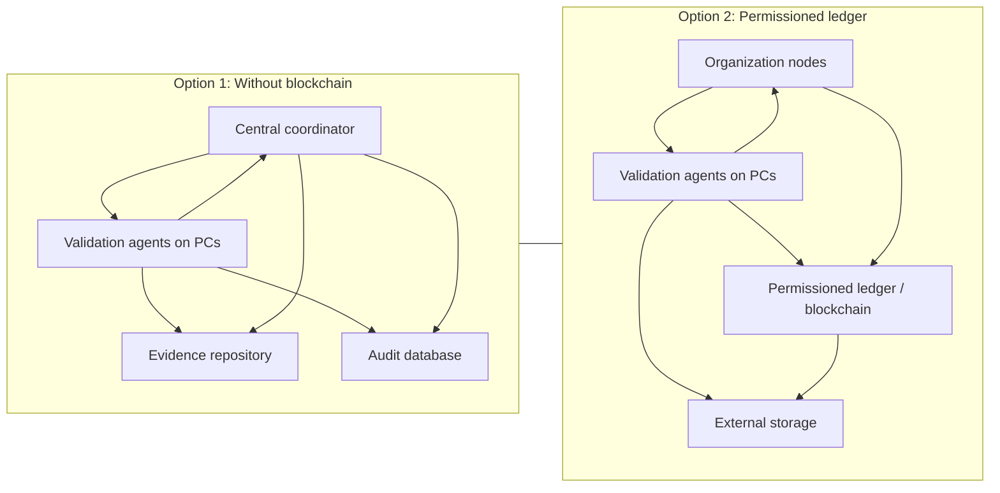

# Blockchain-Like Approaches for TSF

## Index

1. [Should TSF Use Blockchain?](#1-should-tsf-use-blockchain)
2. [Advantages and Disadvantages](#2-advantages-and-disadvantages)
3. [Detailed Analysis and Practical TSF Proposal](#3-detailed-analysis-and-practical-tsf-proposal)
4. [Architecture Diagram (English)](#4-architecture-diagram-english)
5. [Comparison: With and Without Blockchain](#5-comparison-with-and-without-blockchain)
6. [Recommendations for Companies Using TSF (Eclipse)](#6-recommendations-for-companies-using-tsf-eclipse)

## 1. Should TSF Use Blockchain?

TSF usually needs the following capabilities:

- traceability
- versioning
- auditing
- validation evidence
- artifact integrity

In most cases, these are better addressed with:

- Git
- hashes and digital signatures
- immutable or append-only logs
- CI/CD with versioned artifacts
- a well-defined audit trail

Blockchain starts to make sense only when there is a real need for:

- multiple parties with limited mutual trust
- a shared register across organizations
- prevention of unilateral history changes
- independent/public proof of integrity or timestamp

### Multi-Organization Context With Partial Distrust

For organizations working together with some distrust, a blockchain-like shared immutable ledger can make more sense, especially when the parties need to:

- register contributions in an auditable way
- prove validation integrity
- prevent one party from changing past records
- share evidence without relying on a server controlled by only one party

Even then, in many scenarios a simpler setup can still work:

- signed records
- append-only storage
- trusted timestamping
- agreed consensus process between parties

### Same-Organization Context

If multiple people in the same organization run TSF validation from their PCs, this is mainly a distributed computing/orchestration problem, not necessarily a blockchain problem.

If the goal is to run validation algorithms on multiple PCs and aggregate results, this is typically about:

- distributed execution
- job orchestration
- reproducible validation
- signed evidence collection

Blockchain only adds clear value if you must guarantee that no one can later alter who executed what and when.

For a single organization, this is usually simpler and better with:

- a centralized pipeline
- execution agents
- immutable logs
- digital signatures
- result hashing

## 2. Advantages and Disadvantages

The core additional value of blockchain in TSF-like workflows is stronger immutability guarantees for execution history.To have a General Ledger like an accountant.

### Advantages

- stronger trust between parties without a single central authority
- stronger audit trail
- harder to tamper with historical records
- useful to prove who validated what and when
- helpful for inter-company partnerships and joint ventures

### Disadvantages

- high complexity
- higher implementation and maintenance cost
- additional latency
- difficult governance between organizations
- privacy and confidentiality challenges
- not suitable for heavy computation itself
- risk of overengineering

### Conclusion

- Within the same organization: blockchain is usually not worth it.
- Across organizations with real distrust: it can make sense, but a simpler distributed audit system may still be enough.
- If the focus is TSF validation on multiple PCs: the main challenge is orchestration and evidence management, not blockchain itself.

## 3. Detailed Analysis and Practical TSF Proposal

### 3.1 Option A: Without Blockchain (Recommended in Most Cases)

#### Objective

- multiple people or machines execute validation
- results are recorded reliably
- operations remain simple

#### Architecture

- central orchestration server
- validation agents on organization PCs
- central evidence/artifact repository
- database for job states and results
- immutable or append-only logs
- digital signature for each agent output

#### Flow

- team publishes TSF version to validate
- server distributes jobs to available PCs
- each PC runs validation algorithms
- each agent produces:
  - result
  - timestamp
  - hash of used artifacts
  - executor signature
- server aggregates outputs and checks consistency
- final reports are generated automatically

#### Advantages

- simple
- cost-effective
- easy to maintain
- fast
- enough for one organization

#### Disadvantages

- central system dependency
- lower resistance in cross-organization disputes
- trust is anchored in the operator organization

### 3.2 Option B: Shared Ledger or Permissioned Blockchain

#### Objective

- multiple organizations contribute
- limited mutual trust exists
- stronger shared auditability is required

#### Architecture

- permissioned network between organizations
- one node per organization
- validation agents still run on PCs
- results submitted as ledger transactions
- heavy artifacts kept off-chain
- on-chain data includes only:
  - hashes
  - job IDs
  - signatures
  - timestamps
  - states
  - pointers to external evidence

#### Flow

- one organization creates validation request
- network records the job
- PCs execute validation
- each result is submitted with hash and signature
- network validates and records event
- all parties can later audit full sequence

#### Advantages

- reduced dependence on a single authority
- improved trust across entities
- harder post-fact tampering
- stronger support for audit/dispute handling
- useful in partnerships and joint ventures

#### Disadvantages

- more complex
- more expensive
- slower
- requires multi-party governance
- difficult permission/privacy design
- not suitable for storing large evidence directly on-chain

## 4. Architecture Diagram (English)

## 5. Comparison: With and Without Blockchain

### Without Blockchain

- best for a single organization
- simpler and cheaper
- easier to maintain

### With Shared Ledger

- better for multiple organizations
- stronger auditability and trust guarantees
- more complex and slower

## 6. Recommendations for Companies Using TSF (Eclipse)

If the main goals are:

- robust TSF validation
- distributed validation across multiple PCs
- strong evidence quality

then the best approach is usually:

- start without blockchain
- use distributed execution
- store hashes and signatures
- keep auditable logs
- consider a shared ledger only when multiple organizations have real trust boundaries

For TSF specifically, a conventional architecture is usually enough, strengthened with:

- requirement and evidence hashing
- digital signatures
- append-only storage
- automated auditing
- external timestamp sealing when required

### Practical Decision Rule

Use no blockchain when:

- all actors are in the same organization
- internal trust is reasonable
- efficiency is the main priority

Use a shared ledger when:

- multiple organizations are involved
- independent auditability is required
- dispute risk is significant
- stronger integrity proof is needed

### Summary

- For TSF validation inside one team, the non-blockchain option is usually best.
- For cross-organization partnerships with real distrust, a permissioned ledger can be justified.
