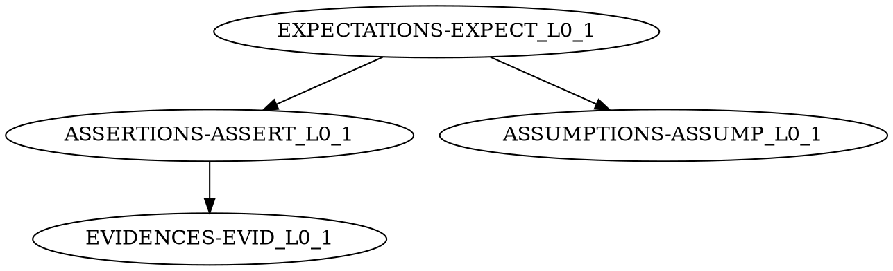

# 🧩 What is TSF (Trustable Software Framework)?

## Overview

The **Trustable Software Framework (TSF)** is an open-source methodology and toolset designed to manage requirements, evidence, and verification activities for safety- and mission-critical software — especially in aerospace, defense, automotive, and medical domains.

**Official Sources:**
- 📘 Codethink GitLab: https://gitlab.com/CodethinkLabs/trustable/trustable
- 📘 Eclipse Project: https://projects.eclipse.org/projects/technology.tsf

---

## Core Concepts

### What TSF Does

Instead of relying on Word documents, Excel sheets, or proprietary requirements tools, TSF integrates **trust metadata directly into the project's Git repository** (alongside code, documentation, and tests).

TSF allows you to:
- **Track expectations and evidence** (who guarantees what and based on which proofs)
- **Quantify trust** (via scores from 0.0 to 1.0)
- **Maintain consistency** between what the software claims to do and what it actually does
- **Automate traceability** between requirements, implementation, and verification

### The Four Statement Types

TSF uses four types of statements stored as Markdown files:

| Type | Prefix | Purpose | Example |
|------|--------|---------|---------|
| **Expectation** | EXPECT | What the system should do | "The system shall display speed data" |
| **Assertion** | ASSERT | Claim that expectation is met | "Speed data display verified via testing" |
| **Evidence** | EVID | Proof supporting assertions | Links to test logs, demos, documentation |
| **Assumption** | ASSUMP | Conditions assumed true | "Hardware components are available" |

### The Traceability Graph (DAG)

TSF creates a **Directed Acyclic Graph (DAG)** showing relationships:

```
EXPECTATION ─────────────┐
     │                   │
     ▼                   ▼
ASSERTION ──────────► ASSUMPTION
     │
     ▼
 EVIDENCE
```

This graph is stored in `.dotstop.dot` and managed by `trudag`.

---

## TSF Scaffolding

The minimal project structure required to apply TSF:

### 1. Statements (Markdown Files)

Each requirement has 4 corresponding files:
- `EXPECT-L0-X.md` - Expectation
- `ASSERT-L0-X.md` - Assertion
- `EVID-L0-X.md` - Evidence
- `ASSUMP-L0-X.md` - Assumption

### 2. Links Graph (`.dotstop.dot`)

A DOT file representing relationships between statements:


### 3. Front-matter Metadata

Each Markdown file contains YAML front-matter:

```yaml
---
id: EXPECT-L0-1
header: "System architecture defined"
text: |
  The demonstrator car system has a documented architecture...
level: 1.1
normative: true
references:
  - type: file
    path: ../assertions/ASSERT-L0-1.md
reviewers:
  - name: Joao Jesus Silva
    email: joao.silva@seame.pt
review_status: accepted
---
```

### 4. Tool Workflow (trudag)

The `trudag` CLI manages the TSF lifecycle:
- `trudag init` - Initialize database
- `trudag score --validate` - Calculate scores with validators
- `trudag publish` - Generate reports
- `trudag lint` - Validate structure

---

## TruDAG Tool

### What is trudag?

`trudag` (Trustable Directed Acyclic Graph) is the command-line tool for TSF:
- Generates traceability diagrams
- Validates statement structure
- Calculates trust scores
- Publishes reports

### Installation

```bash
pip install trudag
```

### Basic Commands

```bash
# Initialize TSF database
trudag init

# Validate and score
trudag score --validate

# Generate reports
trudag publish --output-dir docs/doorstop --validate --all-bodies

# Check for issues
trudag lint
```

---

## Scoring System

TSF assigns scores from **0.0 to 1.0** based on:
- Evidence availability
- Reference validity
- Validator results

### Score Meanings

| Score | Status |
|-------|--------|
| 1.0 | Fully verified with evidence |
| 0.5 | Partially verified |
| 0.0 | Not verified / missing evidence |

### Validators

Custom validators can automatically verify assumptions:
- `validate_hardware_availability` - Checks hardware documentation
- `validate_linux_environment` - Checks Linux tools
- `validate_software_dependencies` - Checks software docs

---

## TSF in Our Project

### Source of Truth Hierarchy

```
Sprints (sprint1.md, sprint2.md, ...) 
    ↓ (evidence extraction)
Requirements Table (tsf-requirements-table.md)
    ↓ (item generation)
TSF Items (items/expectations/, items/assertions/, ...)
    ↓ (trudag processing)
.trudag_items/ (generated)
    ↓ (publishing)
Reports (docs/doorstop/)
```

### Our Implementation

We use a **unified automation script** that:
1. Parses the requirements table
2. Extracts evidence from sprint files
3. Generates/updates TSF items
4. Runs TruDAG validation
5. Publishes reports

**Main Script:**
```bash
source .venv/bin/activate && python3 docs/TSF/tsf_implementation/scripts/open_check_sync_update_validate_run_publish_tsfrequirements.py --all
```

---

## Benefits of TSF

### For Development Teams
- ✅ **Version-controlled requirements** (alongside code)
- ✅ **Automated traceability** (no manual linking)
- ✅ **Quantifiable trust** (scores show progress)
- ✅ **CI/CD integration** (automated validation)

### For Safety-Critical Projects
- ✅ **Audit trail** (Git history shows all changes)
- ✅ **Evidence management** (links to actual artifacts)
- ✅ **Compliance support** (ISO 26262, ASPICE, etc.)

### For Our Project (PiRacer)
- ✅ **30 requirements** tracked with full traceability
- ✅ **120 TSF items** (30 × 4 types)
- ✅ **Automated reports** generated on demand
- ✅ **CI validation** on every PR

---

## Current Status

- **Framework:** Eclipse TSF with TruDAG
- **License:** EPL 2.0 and CC BY-SA 4.0
- **Maintained by:** Codethink
- **Our Implementation:** Fully automated with custom validators

---

## References

- [Codethink TSF GitLab](https://gitlab.com/CodethinkLabs/trustable/trustable)
- [Eclipse TSF Project](https://projects.eclipse.org/projects/technology.tsf)
- [TruDAG Documentation](https://gitlab.com/CodethinkLabs/trustable/trudag)
- [Doorstop (Foundation)](https://github.com/doorstop-dev/doorstop)
