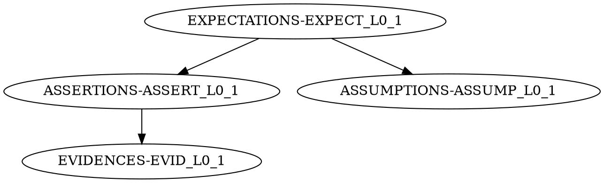

# 🧩 What is TSF (Trustable Software Framework)?

## Index

1. [Script execution commands](#1-script-execution-commands)
2. [Overview](#2-overview)
3. [Core concepts](#3-core-concepts)
4. [TSF scaffolding](#4-tsf-scaffolding)
5. [TruDAG tool](#5-trudag-tool)
6. [Scoring system](#6-scoring-system)
7. [TSF in our project](#7-tsf-in-our-project)
8. [Benefits of TSF](#8-benefits-of-tsf)
9. [Current status](#9-current-status)
10. [References](#10-references)
11. [Implementation update (Mar 2026)](#11-implementation-update-mar-2026)

## 1. Script Execution Commands

## April 2026 Update

- Resolved repeated TruDAG warning caused by local plugin `FileReference` name collision.
- Clarified that interrupted runs (`130`/`143`) are signal-based interruptions, not TSF model errors.
- Content checks now explicitly flag ASSUMP semantic defaults alongside EVID placeholders.

From repository root.

Short form (from repo root, after activating venv):

```bash
source .venv/bin/activate

# Check TSF items
python3 docs/TSF/tsf_implementation/scripts/open_check_sync_update_validate_run_publish_tsfrequirements.py --check

# Sync evidence from sprint markers
python3 docs/TSF/tsf_implementation/scripts/open_check_sync_update_validate_run_publish_tsfrequirements.py --sync

# Run TruDAG validate/score/publish
python3 docs/TSF/tsf_implementation/scripts/open_check_sync_update_validate_run_publish_tsfrequirements.py --validate

# Run everything
python3 docs/TSF/tsf_implementation/scripts/open_check_sync_update_validate_run_publish_tsfrequirements.py --all
```

Full form (from anywhere, includes cd + venv activation):

```bash
# Check TSF items
cd /home/seame/Documents/SEA-ME_Team6_2025-26 && source /home/seame/Documents/SEA-ME_Team6_2025-26/.venv/bin/activate && python3 /home/seame/Documents/SEA-ME_Team6_2025-26/docs/TSF/tsf_implementation/scripts/open_check_sync_update_validate_run_publish_tsfrequirements.py --check

# Sync evidence from sprint markers
cd /home/seame/Documents/SEA-ME_Team6_2025-26 && source /home/seame/Documents/SEA-ME_Team6_2025-26/.venv/bin/activate && python3 /home/seame/Documents/SEA-ME_Team6_2025-26/docs/TSF/tsf_implementation/scripts/open_check_sync_update_validate_run_publish_tsfrequirements.py --sync

# Run TruDAG validate/score/publish
cd /home/seame/Documents/SEA-ME_Team6_2025-26 && source /home/seame/Documents/SEA-ME_Team6_2025-26/.venv/bin/activate && python3 /home/seame/Documents/SEA-ME_Team6_2025-26/docs/TSF/tsf_implementation/scripts/open_check_sync_update_validate_run_publish_tsfrequirements.py --validate

# Run everything
cd /home/seame/Documents/SEA-ME_Team6_2025-26 && source /home/seame/Documents/SEA-ME_Team6_2025-26/.venv/bin/activate && python3 /home/seame/Documents/SEA-ME_Team6_2025-26/docs/TSF/tsf_implementation/scripts/open_check_sync_update_validate_run_publish_tsfrequirements.py --all
```

---

## 2. Overview

The **Trustable Software Framework (TSF)** is an open-source methodology and toolset designed to manage requirements, evidence, and verification activities for safety- and mission-critical software — especially in aerospace, defense, automotive, and medical domains.

**Official Sources:**
- 📘 Codethink GitLab: https://gitlab.com/CodethinkLabs/trustable/trustable
- 📘 Eclipse Project: https://projects.eclipse.org/projects/technology.tsf

---

## 3. Core Concepts

### What TSF Does

Instead of relying on Word documents, Excel sheets, or proprietary requirements tools, TSF integrates **trust metadata directly into the project's Git repository** (alongside code, documentation, and tests).

TSF allows you to:
- **Track expectations and evidence** (who guarantees what and based on which proofs)
- **Quantify trust** (via scores from 0.0 to 1.0)
- **Maintain consistency** between what the software claims to do and what it actually does
- **Automate traceability** between requirements, implementation, and verification

### The Four Statement Types

TSF uses four types of statements stored as Markdown files:

| Type | Prefix | Purpose | Example |
|------|--------|---------|---------|
| **Expectation** | EXPECT | What the system should do | "The system shall display speed data" |
| **Assertion** | ASSERT | Claim that expectation is met | "Speed data display verified via testing" |
| **Evidence** | EVID | Proof supporting assertions | Links to test logs, demos, documentation |
| **Assumption** | ASSUMP | Conditions assumed true | "Hardware components are available" |

### The Traceability Graph (DAG)

TSF creates a **Directed Acyclic Graph (DAG)** showing relationships:

```
EXPECTATION ─────────────┐
     │                   │
     ▼                   ▼
ASSERTION ──────────► ASSUMPTION
     │
     ▼
 EVIDENCE
```

This graph is stored in `.dotstop.dot` and managed by `trudag`.

---

## 4. TSF Scaffolding

The minimal project structure required to apply TSF:

### 1. Statements (Markdown Files)

Each requirement has 4 corresponding files:
- `EXPECT-L0-X.md` - Expectation
- `ASSERT-L0-X.md` - Assertion
- `EVID-L0-X.md` - Evidence
- `ASSUMP-L0-X.md` - Assumption

### 2. Links Graph (`.dotstop.dot`)

A DOT file representing relationships between statements:

```dot
digraph {
    "EXPECTATIONS-EXPECT_L0_1" -> "ASSERTIONS-ASSERT_L0_1"
    "ASSERTIONS-ASSERT_L0_1" -> "EVIDENCES-EVID_L0_1"
    "EXPECTATIONS-EXPECT_L0_1" -> "ASSUMPTIONS-ASSUMP_L0_1"
}
```

### 3. Front-matter Metadata

Each Markdown file contains YAML front-matter:

```yaml
---
id: EXPECT-L0-1
header: "System architecture defined"
text: |
  The demonstrator car system has a documented architecture...
level: 1.1
normative: true
references:
  - type: file
    path: ../assertions/ASSERT-L0-1.md
reviewers:
  - name: Joao Jesus Silva
    email: joao.silva@seame.pt
review_status: accepted
---
```

### 4. Tool Workflow (trudag)

The `trudag` CLI manages the TSF lifecycle:
- `trudag init` - Initialize database
- `trudag score --validate` - Calculate scores with validators
- `trudag publish` - Generate reports
- `trudag lint` - Validate structure

---

## 5. TruDAG Tool

### What is trudag?

`trudag` (Trustable Directed Acyclic Graph) is the command-line tool for TSF:
- Generates traceability diagrams
- Validates statement structure
- Calculates trust scores
- Publishes reports

### System Requirements

| Software | Version | Purpose |
|----------|---------|---------|
| **Python** | 3.11+ | Runtime (required by trudag) |
| **pip** | Latest | Package manager |
| **git** | Latest | Version control |

**Optional:**
| Software | Purpose |
|----------|---------|
| **graphviz** | Graph rendering - only needed for `trudag plot` command |

---

### Installation

#### 🍎 macOS

```bash
# Install Homebrew (if not installed)
/bin/bash -c "$(curl -fsSL https://raw.githubusercontent.com/Homebrew/install/HEAD/install.sh)"

# Add to PATH (Apple Silicon)
echo 'eval "$(/opt/homebrew/bin/brew shellenv)"' >> ~/.zprofile
eval "$(/opt/homebrew/bin/brew shellenv)"

# Install Python 3.11
brew install python@3.11

# Create virtual environment
python3.11 -m venv .venv
source .venv/bin/activate

# Install trudag
pip install --upgrade pip
pip install trustable --index-url https://gitlab.eclipse.org/api/v4/projects/12202/packages/pypi/simple
pip install pyyaml
```

#### 🐧 Linux (Ubuntu/Debian)

```bash
# Install system dependencies
sudo apt update
sudo apt install -y software-properties-common git curl

# Add Python PPA and install Python 3.11
sudo add-apt-repository ppa:deadsnakes/ppa
sudo apt update
sudo apt install -y python3.11 python3.11-venv python3.11-dev

# Create virtual environment
python3.11 -m venv .venv
source .venv/bin/activate

# Install trudag
pip install --upgrade pip
pip install trustable --index-url https://gitlab.eclipse.org/api/v4/projects/12202/packages/pypi/simple
pip install pyyaml
```

#### 🪟 Windows

```powershell
# 1. Download and install Python 3.11+ from python.org
#    ✅ Check "Add Python to PATH" during installation

# 2. Download and install Git from git-scm.com

# 3. Create virtual environment (PowerShell)
python -m venv .venv
.\.venv\Scripts\Activate.ps1

# 4. Install trudag
pip install --upgrade pip
pip install trustable --index-url https://gitlab.eclipse.org/api/v4/projects/12202/packages/pypi/simple
pip install pyyaml
```

#### Verify Installation

```bash
trudag --help
# Should display trudag usage information
```

#### 📊 Optional: Install Graphviz

> **Note:** Graphviz is **optional**. It is only needed if you want to use `trudag plot` to generate visual images of the dependency graph (PNG/SVG).
>
> For the normal workflow (`--check`, `--sync`, `--validate`), **graphviz is NOT required** because:
> - The `graph.dot` file is generated as a text file by the Python script  
> - `trudag` reads and processes the `.dot` file without needing to render it visually

```bash
# macOS
brew install graphviz

# Linux
sudo apt install -y graphviz

# Windows: Download from graphviz.org and add to PATH
```

---

### Basic Commands

```bash
# Initialize TSF database
trudag init

# Validate and score
trudag score --validate

# Generate reports
trudag publish --output-dir docs/doorstop --validate --all-bodies

# Check for issues
trudag lint
```

---

## 6. Scoring System

TSF assigns scores from **0.0 to 1.0** based on:
- Evidence availability
- Reference validity
- Validator results

### Score Meanings

| Score | Status |
|-------|--------|
| 1.0 | Fully verified with evidence |
| 0.5 | Partially verified |
| 0.0 | Not verified / missing evidence |

### Validators

Custom validators can automatically verify assumptions:
- `validate_hardware_availability` - Checks hardware documentation
- `validate_linux_environment` - Checks Linux tools
- `validate_software_dependencies` - Checks software docs

---

## 7. TSF in Our Project

### Source of Truth Hierarchy

```
Sprints (sprint1.md, sprint2.md, ...) 
    ↓ (evidence extraction)
Requirements Table (tsf-requirements-table.md)
    ↓ (item generation)
TSF Items (items/expectations/, items/assertions/, ...)
    ↓ (trudag processing)
.trudag_items/ (generated)
    ↓ (publishing)
Reports (docs/doorstop/)
```

### Our Implementation

We use a **unified automation script** that:
1. Parses the requirements table
2. Extracts evidence from sprint files
3. Generates/updates TSF items
4. Runs TruDAG validation
5. Publishes reports

**Main Script:**
```bash
source .venv/bin/activate && python3 docs/TSF/tsf_implementation/scripts/open_check_sync_update_validate_run_publish_tsfrequirements.py --all
```

---

## 8. Benefits of TSF

### For Development Teams
- ✅ **Version-controlled requirements** (alongside code)
- ✅ **Automated traceability** (no manual linking)
- ✅ **Quantifiable trust** (scores show progress)
- ✅ **CI/CD integration** (automated validation)

### For Safety-Critical Projects
- ✅ **Audit trail** (Git history shows all changes)
- ✅ **Evidence management** (links to actual artifacts)
- ✅ **Compliance support** (ISO 26262, ASPICE, etc.)

### For Our Project (PiRacer)
- ✅ **30 requirements** tracked with full traceability
- ✅ **120 TSF items** (30 × 4 types)
- ✅ **Automated reports** generated on demand
- ✅ **CI validation** on every PR

---

## 9. Current Status

- **Framework:** Eclipse TSF with TruDAG
- **License:** EPL 2.0 and CC BY-SA 4.0
- **Maintained by:** Codethink
- **Our Implementation:** Fully automated with custom validators

---

## 10. References

- [Codethink TSF GitLab](https://gitlab.com/CodethinkLabs/trustable/trustable)
- [Eclipse TSF Project](https://projects.eclipse.org/projects/technology.tsf)
- [TruDAG Documentation](https://gitlab.com/CodethinkLabs/trustable/trudag)
- [Doorstop (Foundation)](https://github.com/doorstop-dev/doorstop)

---

## 11. Implementation Update (Mar 2026)

In our current TSF implementation, a scoring regression to `0/124` was addressed by:

1. fixing symlink and path handling in `setup_trudag_clean.sh`
2. aligning custom validator signatures with TruDAG discovery requirements
3. making `validate_software_dependencies` accept `components` as a valid configuration key

Current score state after these corrections: `82/124`.
