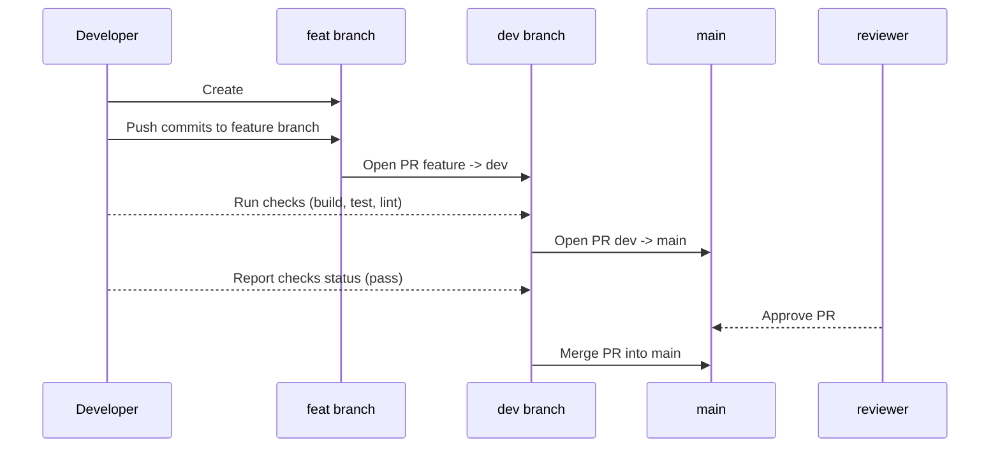

# Contributing Guide – SEA:ME Team 6 (2025/26)

This document explains **how we work** in this repo: branches, commits, PRs, reviews, CI, documentation, and our sprint strategy.

---

## 🔀 Branching

- **main** → protected and release-ready.
- **dev** → integration branch; all features merge here first.
- **branch number**-<epic>/\<name> → working branches off **dev**.
  - Example:
    - `#12-QtApp-mockup`

---

## 🧭 Working Flow

## ✅ Definition of Ready (DoR)

A task/issue is **Ready** when:
- Goal is clear (acceptance criteria written).
- Linked to an **Epic**.
- Labeled (e.g., `Sprint 1`, `Type: Task`, `Daily Meeting`, `Blocked`).

---

## 🧩 Definition of Done (DoD)

A change is **Done** when:
- Code compiles; tests pass.
- **PR template** filled (Summary, Testing, **TSF Traceability**).
- Evidence added (logs/screenshots).
- Docs updated (README or `/docs`).
- At least **1 approval** for PRs into **main**.
---

## 🧱 TSF Traceability (always in PR)

** Still working on this part (will update when me and @jpjpcs finish this part) **

Keep the TSF table updated in the PR body:

| Requirement ID | Description | Status |
|---|---|---|
| REQ-001 | Display speed on screen | ✅ Implemented |
| REQ-002 | Remote control capability | ⚙️ In Progress |

---

## 🧠 Commit Style (Conventional Commits)

We should write clear commits, nothing to long.
Keep it simple for clarity.

- `feat(ui): add speedometer widget`
- `fix(rt): correct timer overflow`
- `docs(workflow): add daily meeting explainer`
- `chore(ci): bump actions/checkout to v4`

Small commits are easier to review.

---

## 🔃 Pull Requests

Open PRs from `feature/*` → **dev**. Later, open **dev → main** for releases.

**PR requirements**
- Use the repo **PR Template**.
- Clear **Summary**, **Testing steps**, **TSF table**.
- Link Issues/Epics (`Closes #123`, `Relates to Epic: ...`).

**Reviews**
- 1 approval required for **main**.

**Merging**
- **Merge** into **dev** and **main**.
- Delete merged branches.

---

## 🔧 CI & Automation

**(Need to work more on this part, later I will create a document to explain GitHub actions)**

- **GitHub Actions** run on PRs/Issues (build/test/lint, docs helpers).
- **Daily Standup**: Issue form creates an artifact with `YYYY-MM-DD-daily.md` and comments instructions to commit it via normal PR.

---

## 🗺️ Sprints

- Sprint lives in the **Project board** (Sprint view).  
- Use labels to filter and track (examples):  
  `Sprint 1`, `Type: Epic`, `Daily Meeting`, `Blocked`.
- Link tasks to Epics for traceability.