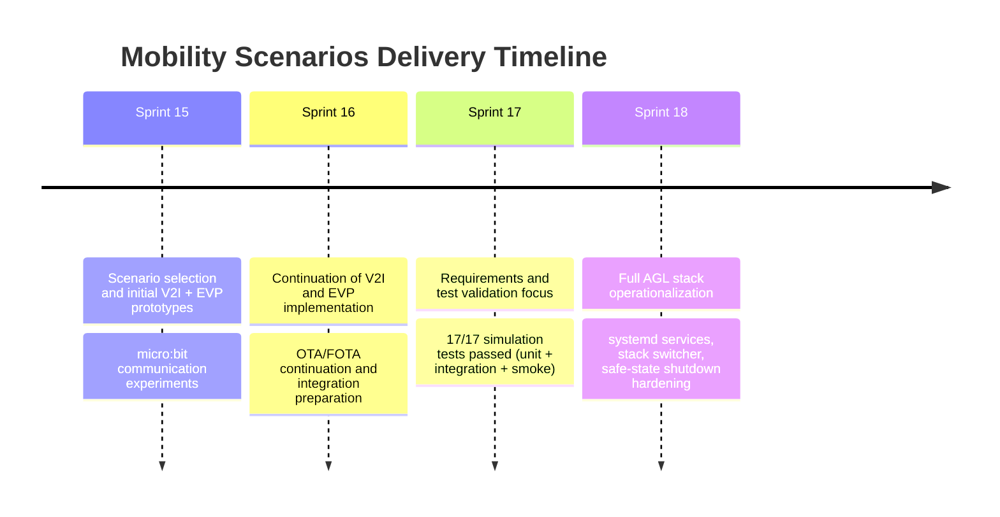
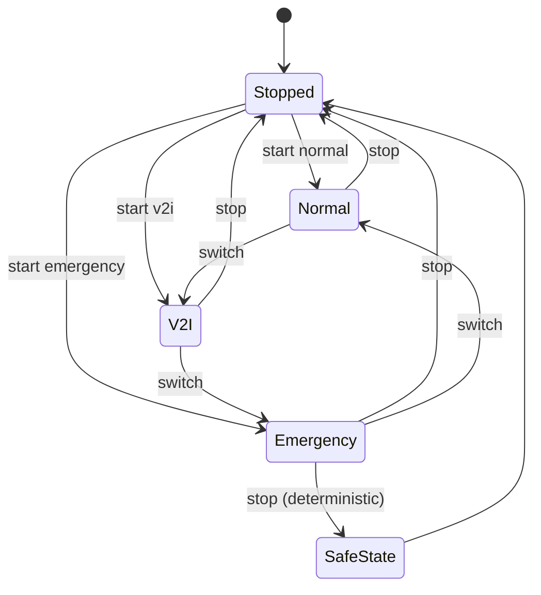
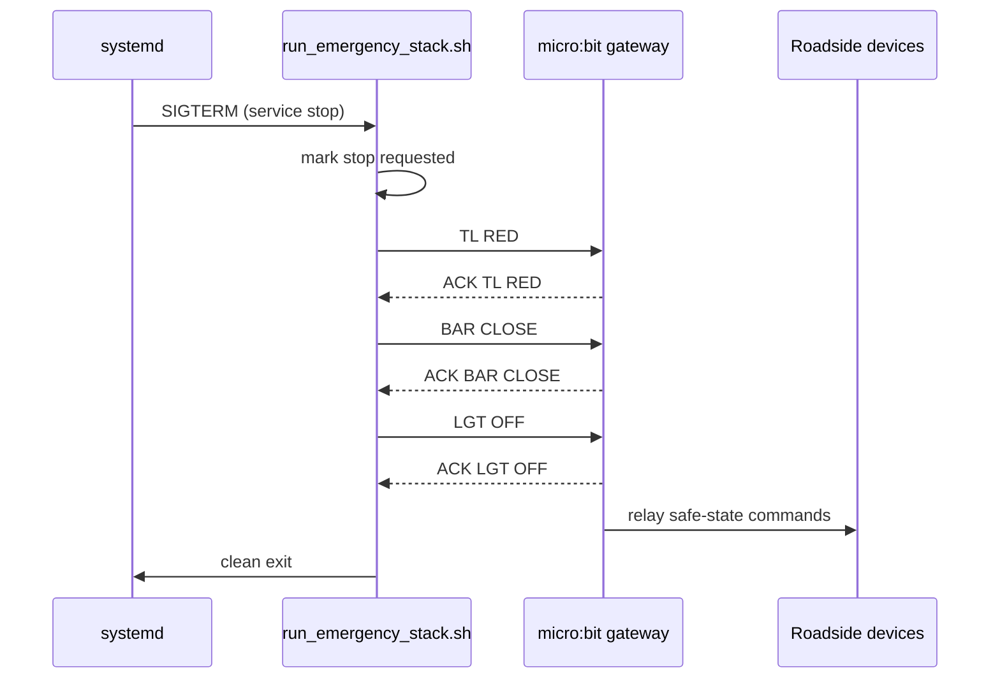

# Mobility Scenarios Explication (Sprint 15 to Sprint 18)

## Purpose

This document explains the complete Mobility Scenarios module evolution from Sprint 15 to Sprint 18, including architecture, implementation strategy, validation logic, deployment model, and final operational behavior.

The two selected module scenarios were:

- Vehicle-to-Infrastructure (V2I) traffic control.
- Emergency Vehicle Priority (EVP) with roadside override.

## Timeline Overview



## Sprint-by-Sprint Evolution

## Sprint 15

### Goal

Familiarization with Mobility Scenarios and implementation of first functional prototypes.

### Main Contributions

- Initial V2I communication concept (vehicle affected by infrastructure state).
- Initial emergency priority concept (traffic flow override for emergency vehicle).
- First practical micro:bit communications for roadside interactions.
- Architecture and feasibility framing for Module 3 delivery.

### Result

A validated technical direction and initial software/hardware building blocks for V2I and emergency behavior.

## Sprint 16

### Goal

Continue V2I and emergency implementation while OTA/FOTA work progressed in parallel.

### Main Contributions

- Consolidated scenario logic implementation.
- Improved integration readiness for ADAS Manager coupling.
- Preserved development continuity despite known system constraints.

### Result

Most scenario logic was already available before final integration, reducing Sprint 18 integration risk.

## Sprint 17

### Goal

Requirements review and robust test validation before production-like hardware operation.

### Main Contributions

- Emergency Vehicle Priority test campaign completed.
- 17/17 tests passing in simulation:
  - Unit tests.
  - Integration tests.
  - End-to-end smoke workflow.
- Safety and arbitration behavior verified in controlled conditions.

### Result

Behavior correctness was proven before direct deployment into operational vehicle stack.

## Sprint 18

### Goal

Deliver final autonomous-driving-ready mobility stack with practical emergency priority operation.

### Main Contributions

- Introduced three operational runtime stacks:
  - Normal autonomous mode.
  - V2I mode.
  - Emergency mode.
- Implemented systemd service architecture for repeatable execution.
- Implemented scenario switch orchestration (`normal`, `v2i`, `emergency`, `stop`, `status`).
- Added interactive runtime selector with keyboard switching (`N`, `V`, `E`, `S`, `Q`).
- Hardened emergency shutdown to guaranteed physical safe-state outputs.

### Result

Mobility Scenarios became deployable and operable as practical runtime modes on AGL.

## Final Architecture

```mermaid
flowchart LR
    A[Operator] --> B[stack-switch.sh / stack_mode_selector.py]
    B --> C[systemd stack unit]

    C --> D[adas_manager]
    C --> E[joystick_control.py]

    C --> F1[roadside_scenario_runtime.py]
    C --> F2[roadside_emergency_controller.py]

    F1 --> G[/tmp/adas_v2i.sock]
    F2 --> G
    F2 --> H[/tmp/adas_emergency.sock]

    D --> I[CAN control pipeline]
    D --> J[KUKSA / telemetry path]

    F1 --> K[micro:bit gateway serial]
    F2 --> K
    K --> L[Traffic light node]
    K --> M[Barrier node]
    K --> N[Streetlight node]
```

## Runtime Modes



## Emergency Shutdown Safety Design

When emergency mode is stopped, the stack now enforces deterministic physical outputs.



This design avoids race conditions where the controller might terminate before applying all safe commands.

## Key Technical Decisions

- Keep ADAS safety arbitration authoritative, independent of V2I priority intent.
- Use service wrappers to enforce startup ordering and process supervision.
- Use explicit stack switching instead of uncontrolled concurrent scenario processes.
- Use `/dev/serial/by-id/...` paths to avoid unstable `ttyACM*` mapping.
- Add unbuffered logging to improve root-cause analysis in `journalctl`.
- Disable auto-start for mobility stacks by default to prevent unintended autonomous motion after reboot.

## What Was Implemented

- `adas-normal-stack.service`, `adas-v2i-stack.service`, `adas-emergency-stack.service`.
- `run_normal_stack.sh`, `run_v2i_stack.sh`, `run_emergency_stack.sh`.
- `stack-switch.sh` mode orchestrator.
- `stack_mode_selector.py` interactive selector.
- Emergency controller improvements:
  - ADAS emergency socket reception.
  - gateway probing and sanity checks.
  - explicit safe-state behavior.
- V2I runtime parsing/compatibility fixes.
- Shared micro:bit firmware organization cleanup.

## Validation and Evidence Direction

Operational verification can be performed with:

- `systemctl status adas-normal-stack.service adas-v2i-stack.service adas-emergency-stack.service`
- `journalctl -u adas-emergency-stack.service -f`
- Gateway ACK markers for emergency safe-state:
  - `ACK TL RED`
  - `ACK BAR CLOSE`
  - `ACK LGT OFF`

## Final Module Outcome

By the end of Sprint 18, Module 3 moved from validated simulation behavior to operational, switchable, and safety-aware runtime deployment on AGL.

The team now has:

- A practical V2I scenario.
- A practical Emergency Vehicle Priority scenario.
- A deterministic run/stop/switch operational model.
- Explicit safe-state fallback behavior at emergency shutdown.
- Documentation aligned with implementation reality.
