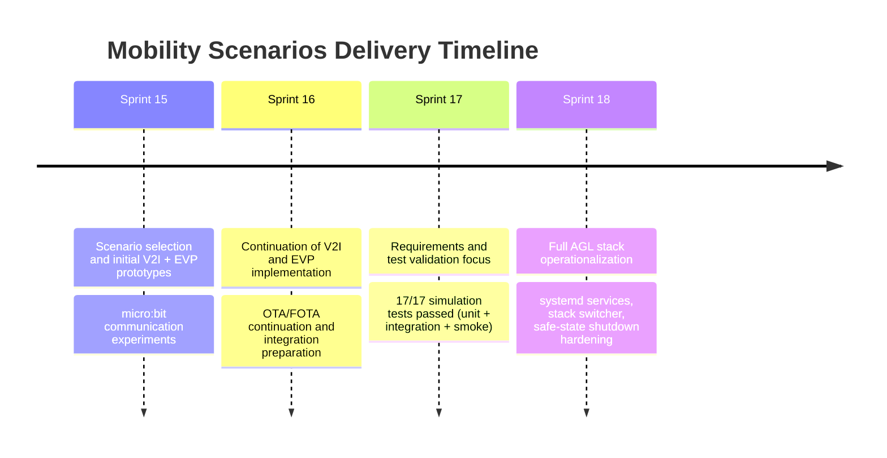
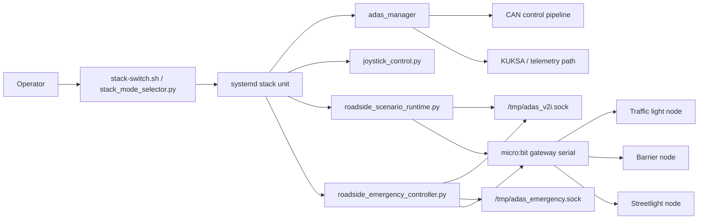
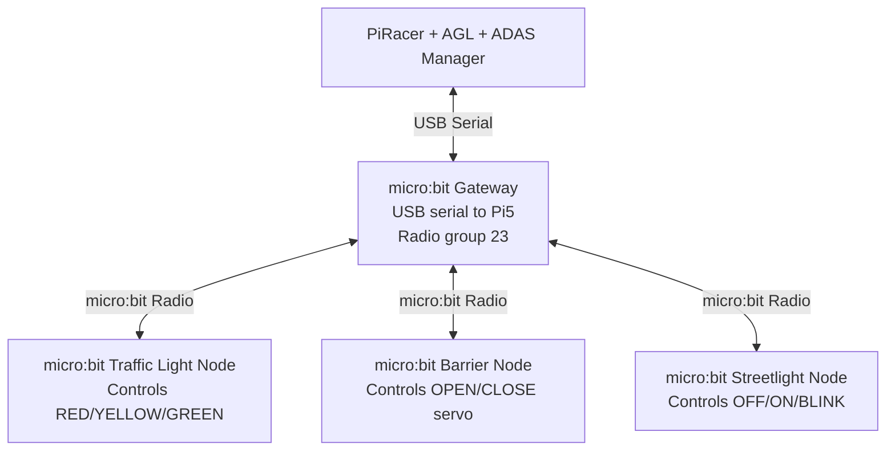
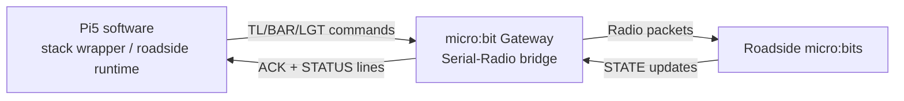
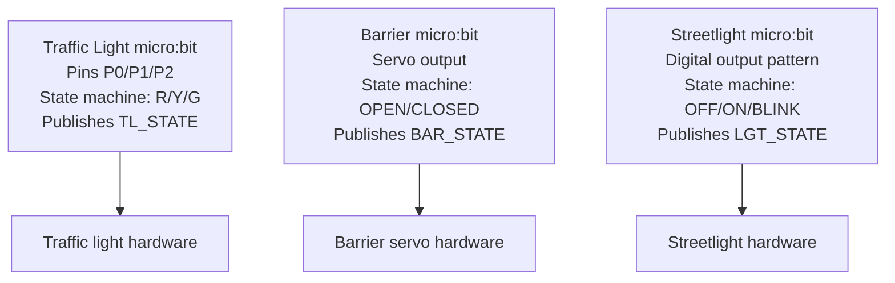
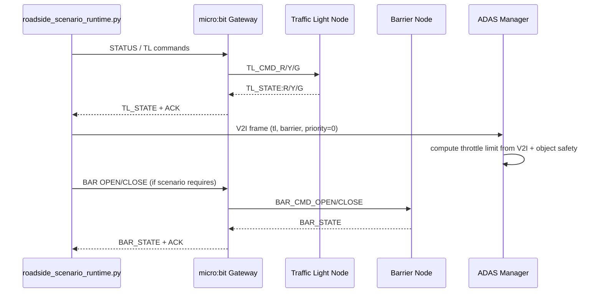
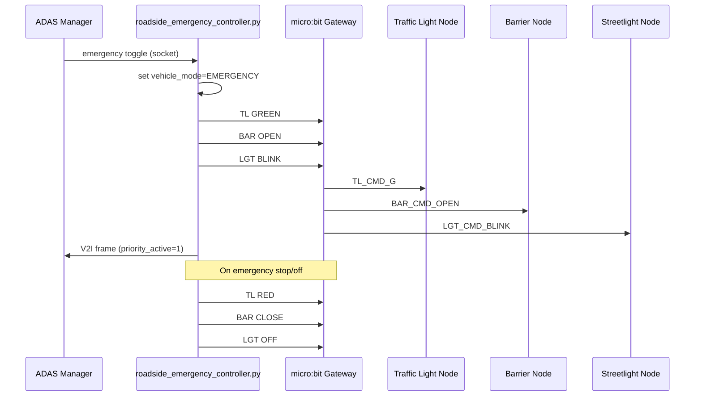
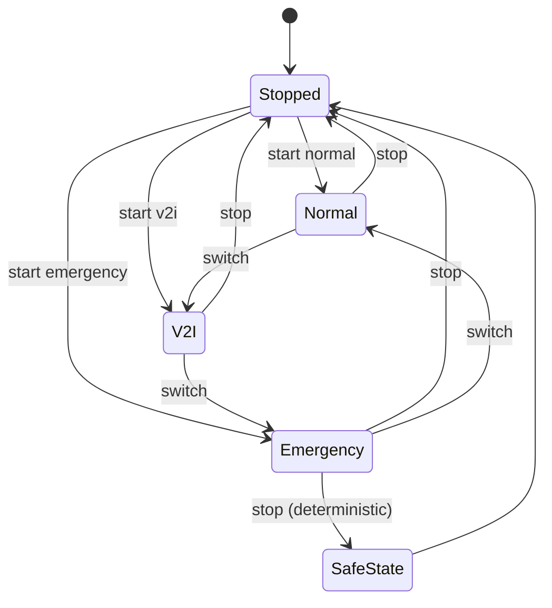
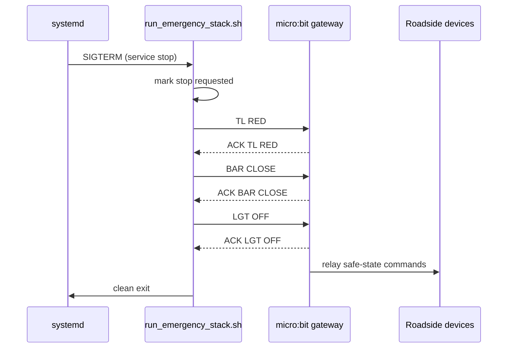

# Mobility Scenarios Explication (Sprint 15 to Sprint 18)

## Index

- [Purpose](#purpose)
- [Timeline Overview](#timeline-overview)
- [Sprint-by-Sprint Evolution](#sprint-by-sprint-evolution)
- [Sprint 15](#sprint-15)
  - [Goal](#goal)
  - [Main Contributions](#main-contributions)
  - [Result](#result)
- [Sprint 16](#sprint-16)
  - [Goal](#goal-1)
  - [Main Contributions](#main-contributions-1)
  - [Result](#result-1)
- [Sprint 17](#sprint-17)
  - [Goal](#goal-2)
  - [Main Contributions](#main-contributions-2)
  - [Result](#result-2)
- [Sprint 18](#sprint-18)
  - [Goal](#goal-3)
  - [Main Contributions](#main-contributions-3)
  - [Result](#result-3)
- [Final Architecture](#final-architecture)
- [Mobility Scenario Graphical Explanation](#mobility-scenario-graphical-explanation)
  - [Physical Topology (Who is connected to what)](#physical-topology-who-is-connected-to-what)
  - [Gateway Role (What it contains and what it does)](#gateway-role-what-it-contains-and-what-it-does)
  - [Roadside Nodes (What each micro:bit contains and does)](#roadside-nodes-what-each-microbit-contains-and-does)
  - [V2I Scenario (Normal infrastructure influence)](#v2i-scenario-normal-infrastructure-influence)
  - [Emergency Scenario (Priority override)](#emergency-scenario-priority-override)
- [Runtime Modes](#runtime-modes)
- [Emergency Shutdown Safety Design](#emergency-shutdown-safety-design)
- [Key Technical Decisions](#key-technical-decisions)
- [What Was Implemented](#what-was-implemented)
- [Validation and Evidence Direction](#validation-and-evidence-direction)
- [Final Module Outcome](#final-module-outcome)

## Purpose

This document explains the complete Mobility Scenarios module evolution from Sprint 15 to Sprint 18, including architecture, implementation strategy, validation logic, deployment model, and final operational behavior.

The two selected module scenarios were:

- Vehicle-to-Infrastructure (V2I) traffic control.
- Emergency Vehicle Priority (EVP) with roadside override.

## Timeline Overview

## Sprint-by-Sprint Evolution

## Sprint 15

### Goal

Familiarization with Mobility Scenarios and implementation of first functional prototypes.

### Main Contributions

- Initial V2I communication concept (vehicle affected by infrastructure state).
- Initial emergency priority concept (traffic flow override for emergency vehicle).
- First practical micro:bit communications for roadside interactions.
- Architecture and feasibility framing for Module 3 delivery.

### Result

A validated technical direction and initial software/hardware building blocks for V2I and emergency behavior.

## Sprint 16

### Goal

Continue V2I and emergency implementation while OTA/FOTA work progressed in parallel.

### Main Contributions

- Consolidated scenario logic implementation.
- Improved integration readiness for ADAS Manager coupling.
- Preserved development continuity despite known system constraints.

### Result

Most scenario logic was already available before final integration, reducing Sprint 18 integration risk.

## Sprint 17

### Goal

Requirements review and robust test validation before production-like hardware operation.

### Main Contributions

- Emergency Vehicle Priority test campaign completed.
- 17/17 tests passing in simulation:
  - Unit tests.
  - Integration tests.
  - End-to-end smoke workflow.
- Safety and arbitration behavior verified in controlled conditions.

### Result

Behavior correctness was proven before direct deployment into operational vehicle stack.

## Sprint 18

### Goal

Deliver final autonomous-driving-ready mobility stack with practical emergency priority operation.

### Main Contributions

- Introduced three operational runtime stacks:
  - Normal autonomous mode.
  - V2I mode.
  - Emergency mode.
- Implemented systemd service architecture for repeatable execution.
- Implemented scenario switch orchestration (`normal`, `v2i`, `emergency`, `stop`, `status`).
- Added interactive runtime selector with keyboard switching (`N`, `V`, `E`, `S`, `Q`).
- Hardened emergency shutdown to guaranteed physical safe-state outputs.

### Result

Mobility Scenarios became deployable and operable as practical runtime modes on AGL.

## Final Architecture

## Mobility Scenario Graphical Explanation

This section explains the physical topology and runtime behavior of the mobility scenario with one gateway micro:bit connected to the vehicle computer and three roadside micro:bits connected to actuators.

### Physical Topology (Who is connected to what)

### Gateway Role (What it contains and what it does)

The gateway micro:bit is the protocol bridge between Linux software and roadside radio devices.

- **Input from Pi (serial commands):**
  - `TL RED`, `TL YELLOW`, `TL GREEN`
  - `BAR OPEN`, `BAR CLOSE`
  - `LGT ON`, `LGT OFF`, `LGT BLINK`
  - `STATUS`
- **Output to radio:** relays these commands to the appropriate roadside node.
- **Input from radio nodes:** receives state reports (`TL_STATE:*`, `BAR_STATE:*`, `LGT_STATE:*`).
- **Output to Pi:** prints ACK and state lines over USB serial for logging and monitoring.

### Roadside Nodes (What each micro:bit contains and does)

### V2I Scenario (Normal infrastructure influence)

In V2I mode, infrastructure state affects vehicle behavior through ADAS V2I socket updates.

1. Roadside runtime reads traffic-light state and scenario logic.
2. Runtime sends V2I frame to ADAS (`/tmp/adas_v2i.sock`).
3. ADAS applies throttle arbitration with safety rules.
4. Runtime sends infrastructure commands through gateway to keep roadside in sync.

### Emergency Scenario (Priority override)

In emergency mode, the emergency controller forces priority behavior and roadside override.

  1. Emergency toggle arrives from ADAS socket (`/tmp/adas_emergency.sock`) or keyboard.
  2. Controller sets emergency policy active.
  3. Controller commands roadside via gateway:
    - traffic light to emergency-pass state,
    - barrier open,
    - streetlight blink.
  4. Controller sends `priority_active=1` in V2I frame to ADAS.
  5. On stop/off, system enforces safe-state: `TL RED`, `BAR CLOSE`, `LGT OFF`.

## Runtime Modes

## Emergency Shutdown Safety Design

When emergency mode is stopped, the stack now enforces deterministic physical outputs.

This design avoids race conditions where the controller might terminate before applying all safe commands.

## Key Technical Decisions

- Keep ADAS safety arbitration authoritative, independent of V2I priority intent.
- Use service wrappers to enforce startup ordering and process supervision.
- Use explicit stack switching instead of uncontrolled concurrent scenario processes.
- Use `/dev/serial/by-id/...` paths to avoid unstable `ttyACM*` mapping.
- Add unbuffered logging to improve root-cause analysis in `journalctl`.
- Disable auto-start for mobility stacks by default to prevent unintended autonomous motion after reboot.

## What Was Implemented

- `adas-normal-stack.service`, `adas-v2i-stack.service`, `adas-emergency-stack.service`.
- `run_normal_stack.sh`, `run_v2i_stack.sh`, `run_emergency_stack.sh`.
- `stack-switch.sh` mode orchestrator.
- `stack_mode_selector.py` interactive selector.
- Emergency controller improvements:
  - ADAS emergency socket reception.
  - gateway probing and sanity checks.
  - explicit safe-state behavior.
- V2I runtime parsing/compatibility fixes.
- Shared micro:bit firmware organization cleanup.

## Validation and Evidence Direction

Operational verification can be performed with:

- `systemctl status adas-normal-stack.service adas-v2i-stack.service adas-emergency-stack.service`
- `journalctl -u adas-emergency-stack.service -f`
- Gateway ACK markers for emergency safe-state:
  - `ACK TL RED`
  - `ACK BAR CLOSE`
  - `ACK LGT OFF`

## Final Module Outcome

By the end of Sprint 18, Module 3 moved from validated simulation behavior to operational, switchable, and safety-aware runtime deployment on AGL.

The team now has:

- A practical V2I scenario.
- A practical Emergency Vehicle Priority scenario.
- A deterministic run/stop/switch operational model.
- Explicit safe-state fallback behavior at emergency shutdown.
- Documentation aligned with implementation reality.
