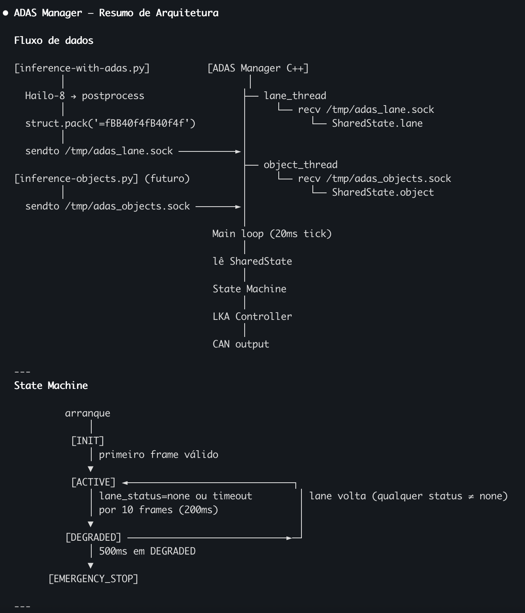

# ADAS Manager v11

## Overview

C++ process that receives perception data via UNIX DGRAM sockets, runs LKA (Lane Keep Assist) with a PID controller, sends steering/throttle commands to the STM32 via CAN bus, and publishes telemetry to the KUKSA Databroker via an asynchronous bridge thread.

```
[INFERENCE_DUAL.py]
    │ LaneFrame (359B)   → /tmp/adas_lane.sock
    │ ObjectFrame (37B)  → /tmp/adas_objects.sock
    ▼
[adas_manager — C++]
    ├── lane_thread    — receives LaneFrame
    ├── object_thread  — receives ObjectFrame
    ├── bridge_thread  — async KUKSA publish (non-blocking queue)
    └── main loop (20ms tick)
            │
            ├── state machine (INIT → ACTIVE → DEGRADED → EMERGENCY_STOP)
            ├── LKAController (PID + EMA + deadband + rate limit)
            ├── object throttle override (stop sign / collision)
            ├── bridge.pub_lane() / bridge.pub_objects()  ← non-blocking
            │
            ▼
        CanSender → can1
            │ 0x500: steering (int16) + throttle (int16)
            │ 0x001: EmergencyStop_t (active + CRC-8)
            ▼
        [STM32 / ThreadX]

        bridge_thread (KuksaBridge)
            │ queue<string> max 4 msgs
            │ fputs + fflush → pipe stdin
            ▼
        [kuksa_bridge.py — subprocess]
            │ gRPC v2 TLS + JWT
            ▼
        [KUKSA Databroker — 10.21.220.191:55555]
```

---

## State Machine - still working on it



Transitions from any state to ACTIVE happen immediately when `lane_ok=true`, except from EMERGENCY_STOP which requires `recovery_threshold_frames` consecutive valid frames.

---

## LKA Controller

### Computation pipeline (per 20ms tick)

Still working on it - but it is working for now
Documentation needed on LKA

### Parameters (`/data/lka_config.conf`)

| Parameter | Default | Description |
|---|---|---|
| `kp` | 4.0 | Proportional gain |
| `ki` | 0.0 | Integral gain |
| `kd` | 3.0 | Derivative gain |
| `ema_alpha` | 0.5 | EMA smoothing (0=frozen, 1=no smoothing) |
| `deadband` | 2.0 | Deviations below this are ignored (cm) |
| `snap` | 2.0 | PID outputs below this → steering=0 |
| `max_rate` | 20 | Max steering change per tick |
| `throttle` | 35 | Base throttle [0-100] |
| `degraded_threshold_frames` | 10 | Frames without lane before entering DEGRADED |
| `emergency_threshold_ms` | 500 | ms in DEGRADED before EMERGENCY_STOP |
| `recovery_threshold_frames` | 15 | Consecutive valid frames to exit EMERGENCY_STOP |
| `obj_conf_thresh` | 0.60 | Minimum confidence to act on a detected object |
| `collision_dist_m` | 0.30 | Distance (m) triggering emergency stop |

**The file is read once at startup.** To apply changes: edit `/data/lka_config.conf` and restart the process.

---

## Object Detection in ADAS

Need to implement the distance measurement to implement this properly.

For now its like this:
Independent of the state machine. Applied in all states except EMERGENCY_STOP.

| Condition | Max throttle |
|---|---|
| No objects / confidence < thresh | 100 (no override) |
| `SIGN_YIELD` detected | 50% of base throttle |
| `SIGN_STOP` detected | 0 (full stop) |
| `distance < collision_dist_m` | 0 (full stop) |

`throttle_final = min(THROTTLE, throttle_limit)`

---

## CAN Protocol - needs new implementation

### 0x500 — Control (sent every tick in ACTIVE/DEGRADED)

```
DLC: 4 bytes
data[0:2] = int16_t steering  (little-endian, range [-100, 100])
data[2:4] = int16_t throttle  (little-endian, range [0, 100])
```

Channel: `can1`

### 0x001 — Emergency Stop (sent on entering EMERGENCY_STOP)

```
DLC: 8 bytes
data[0]   = active (1=active)
data[1]   = source = 2 (AGL)
data[2:4] = distance_mm = 0 (uint16 LE)
data[4]   = reason = 0x10 (LANE_LOSS)
data[5:7] = reserved = 0
data[7]   = CRC-8 (poly=0x07, init=0x00) over bytes 0-6
```

---

## Input Sockets

### `/tmp/adas_lane.sock` — LaneFrame (359 bytes)

```c
struct LaneFrame {            // __attribute__((packed))
    float      lateral_deviation;   // deviation in cm (or normalised)
    uint8_t    lane_status;         // 0=none 1=left 2=right 3=both
    LaneObject lane_left;           // 177 bytes (mock zeros — future MPC)
    LaneObject lane_right;          // 177 bytes (mock zeros — future MPC)
};
```

`receiveLatest` drains the socket queue and keeps only the most recent frame, preventing backlog.

### `/tmp/adas_objects.sock` — ObjectFrame (37 bytes)

```c
struct ObjectFrame {          // __attribute__((packed))
    uint8_t        count;
    DetectedObject objects[4];  // class_id + confidence + distance_m
};
```

Both frames are binary packed structs — no serialisation overhead.

### Receive timeout

`RECV_TIMEOUT_MS = 60ms`. If no frame arrives within a tick, `lane_valid = false` and the degradation counter increments.

---

## KUKSA Bridge

The KUKSA bridge runs as an asynchronous subprocess. The control loop never blocks on network I/O.

**Summary:**
- `bridge.pub_lane()` / `bridge.pub_objects()` enqueue a formatted string and return immediately
- A dedicated `bridge_thread` drains the queue and writes to the subprocess pipe
- Queue capacity: 4 messages — oldest is dropped if KUKSA is slow
- If `kuksa_bridge.py` crashes or credentials are missing, the control loop is unaffected

---

## Files

| File | Description |
|---|---|
| `adas_manager.cpp` | Main — state machine, control loop, config loading, KuksaBridge |
| `socket_receiver.hpp` | SocketReceiver + LaneFrame / ObjectFrame structs |
| `lka_controller.hpp` | PID + LKAController (EMA, deadband, snap, rate limit) |
| `can_sender.hpp` | CanSender — CAN frames 0x500 and 0x001 with CRC-8 |
| `kuksa_bridge.py` | Subprocess — reads stdin, publishes to KUKSA via gRPC TLS |
| `lka_config.conf` | Runtime parameters (read from `/data/lka_config.conf`) |

---

## Build

```bash
g++ -O2 -std=c++17 -o adas_manager adas_manager.cpp -lpthread
```

The binary always reads `/data/lka_config.conf`. Changing the path requires recompilation.

---

## Startup

The ADAS Manager must be started **before** the inference script — it creates and binds the sockets `/tmp/adas_lane.sock` and `/tmp/adas_objects.sock`.

```bash
/data/ADAS-Manager-test-v11/adas_manager
```

## Next steps:
- [ ] New CAN Protocol for ADAS Manager
- [ ] Object detetion/TSR integration 
- [ ] Creation of ADAS Manager service
