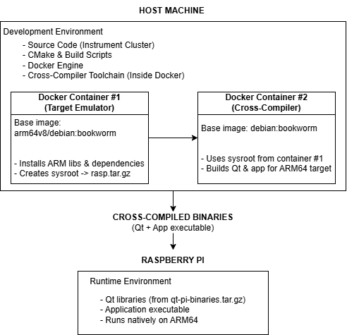

# 🚀 Cross-Compiler

## 📚 Index
- [👋 Introduction](#sec-intro)
- [🧠 Core Ideas](#sec-core-ideas)
- [🤔 Why we use Cross-Compilation](#sec-why-cross)
- [🐋 Why we use Docker](#sec-why-docker)
- [🏗️ System Architecture](#sec-system-architecture)
- [⚙️ How it works (Step by Step)](#sec-how-it-works)
- [🧰 Building with Docker](#sec-build-docker)
- [🚨 Issues Log](#sec-issues)
- [🔗 Links](#sec-links)

---

<a id="sec-intro"></a>
## 👋 Introduction

A cross-compiler is a type of compiler capable of generating executable code for a platform or operating system different from the one which it is running.  
In simpler terms, it allows developers to build programs for another architecture or environment - for example, compiling code on a computer (x86_64) that will later run on a smaller embedded device such as a Raspberry Pi (ARM64).  
Cross-compilation is especially useful when the target system:
 - Has limited computational resources.
 - Runs on a different CPU architecture (eg. ARM vs x86).
 - Uses a different operating system or runtime environment.
 - Cannot easily host a full compiler toolchain due to storage or performance constraints.

Instead of compiling software directly on the target hardware - which is ofter slow and inefficient - we can use a cross-compiler to produce binaries remotely from a more capable development machine.  
This approach not only improves build speed and developer productivity, but also ensure consistency, since the build environment can be standardized using tools like Docker.  
In modern embedded development, cross-compilers are fundamental to building complex frameworks such as Qt, OpenCV or custom Linux kernels, which can be time-consuming or even impossible to compile natively on lightweight devices.  
By defining a clear separation between the host and the target, cross-compilation becomes an essential bridge between desktop development and embedded deployment.

---

<a id="sec-core-ideas"></a>
## 🧠 Core Ideas

- **Cross-compilation**: Process of building software on one system that runs on another, often with a different CPU architecture or OS.
- **Host System**: The development machine performing the build - typically an x86_64 Linux workstation with Docker and CMake installed. 
- **Target System**: The device the software is meant to run on - in this case, a Raspberry Pi running ARM64.
- **Toolchain**: A complete set of compilers, linkers and build tools configured to produce binaries compatible with the target platform.
- **Sysroot**: A structured snapshot of the target's filesystem (libraries, headers, binaries) used during compilation to ensure correct linking and compatibility.
- **CMake Toolchain File**: A configuration file defining compiler paths, sysroot locations and platform settings that guide the cross-compile process.
- **Docker Integration**: Containerized environments used to isolate, reproduce, and automate cross-compilation, avoiding host dependency issues.
- **Dual-Container Architecture**: One Docker image replicates the target system to generate the sysroot, another hosts the cross-compiler that builds the project and Qt for ARM.
- **Qt Cross-Build**: Qt itself is built inside the cross-compiler container using the ARM sysroot, enabling deployment of complect QtQuick/QML apps directly to Raspberry Pi.
- **Dependency Consistency**: Ensures that the same versions of libraries used during compilation exist on the target device, preventing runtime errors.
- **Environment Replication**: Recreates the Raspberry Pi's file system and libraries inside the host machine through Docker, eliminating the need for physical hardware during builds.
- **Automation**: The entire toolchain setup, build and packaging process is fully scripted through Dockerfiles and CMake commands for reproducibility.
- **Performance Optimization:** Cross-compiling on a high-performance host drastically reduces build times compared to compiling natively on ARM hardware.
- **Portability**: The Dockerized toolchain can be shared among team members, CI/CD systems or other workstations, guaranteeing identical builds.
- **Deployment Pipeline**: The compiled binaries and Qt libraries are extracted, transferred to the Raspberry Pi, and executed with the minimal manual configuration.
- **Scability**: The same cross-compile approach can be extended to other ARM-based devices or different embedded platforms.
- **Error Isolation**: Containarized builds prevent host contamination and allow isolated debugging of environment-specific issues.
- **Reproducibility**: Each build is fully deterministic - rebuilding the Docker image always produces the same binaries, ensuring stable software releases.
- **Integration with Project**: The cross-compiler forms the bridge between the development environment (Instrument Cluster source code) and the ARM-based runtime system (Raspberry Pi).

---

<a id="sec-why-cross"></a>
## 🤔 Why we use Cross-Compilation

During the early stages of development, we experimented with several methods to build and deploy our Qt application on the Raspberry Pi.  
Although each method seemed viable in theory, we quickly encountered technical barriers that made local or direct builds impractical.  
The challenges ultimately led us to adopt a cross-compilation workflow, which proved to be faster, more reliable and scalable.

##### **Attempt 1 - Building Directly on the Raspberry Pi**

Our first approach was the most straightforward one - installing all necessary Qt libraries, dependencies, and build tools directly on the Raspberry Pi, then compiling the application natively.  
While simple, this approach exposed several limitations of the Raspberry Pi environment:  
- **Hardware Constraints:**
The Raspberry Pi, while capable for runtime execution, lacks the computational power required to build large projects efficiently. Compiling Qt 6 and the associated modules can take many hours, sometimes exceeding the device's thermal or memory limits.
- **Package Fragmentation and Version Mismatches:**
The official Raspberry Pi repositories provide older or incomplete Qt packages, and attempting to compile newer versions let to incompatible versions, missing modules and dependency conflicts.


Despite several attempts, this method proved unreliable, time-consuming and unsuitable for a reproducible development workflow.

##### **Attempt 2 - Building on the Host and Transferring the Executable**

After facing repeated build failures on the Raspberry Pi, we tried a different strategy, compile the project on our development workstation (Ubuntu x86_64) using the standard Qt setup and then copy the generated binary to the Raspberry Pi via SSH.  
At first this approach seemed promising - compilation on a desktop was fast and stable, and deployment was straightforward.  
However, once transferred the executable refused to run, returning the error:  
```bash
./HelloQt6Qml: cannot execute binary file: Exec format error
```
This occurred because the binary was compiled for a different CPU architecture.  
Our host machine used and x86_64 processor, while the Raspberry Pi runs on an ARM64 (AArch64) architecture.  
Even though both run Linux, their instruction sets, memory alignment, and binary interfaces are fundamentally incompatible.  
In other words, the Raspberry Pi simple could not execute a binary compiled for x86_64.
This approach highlighted a critical reality:  
**To run an application on a target device with a different architecture, you must build it for that architecture.**

After these experiments, it became clear that what we needed was a way to compile on our host machine, taking advantage of its speed and resources, but generate binaries that would run on the Raspberry Pi's ARM64 environment.  
That's where cross-compilation comes in.  
Cross-compilation provided the bridge between the host and target architectures by using a specialized compiled toolchain configured for the target's architecture.  
This means the host can build binaries as if it were "pretending" to be the target system - linking against the correct ARM libraries, headers and system paths - all without ever touching the Raspberry Pi.

<div align="center">
  
</div>

---

<a id="sec-why-docker"></a>
## 🐋 Why we use Docker

Once we decided to use cross-compilation, the next challenge was how to set up and maintain that environment.  
Cross-compiling Qt manually for the Raspberry Pi can be extremely complex, it requires:
- Installing and configuring a cross-compiler toolchain for ARM64.
- Copying or generating a sysroot (a mirror of the target filesystem).
- Setting multiple CMake variables (`CMAKE_SYSROOT`, `CMAKE_PREFIX_PATH`, etc).
- Ensuring consistent library versions between host and target. 

Doing this manually often leads to configuration drift, version conflicts, and inconsistent build across different developers or systems.

##### **Manual Setup**
Without Docker, you can still cross-compile by installing:
```bash
$ sudo apt install gcc-aarch64-linux-gnu g++-aarch64-linux-gnu
```
Then manually setting up environment variables, downloading the Raspberry Pi sysroot, and configuring CMake toolchains.  
However, this approach is:  
- **Error-prone:** One missing path or mismatched library breaks the build.
- **Hard to reproduce:** Every developer must manually replicate the same setup.
- **Unstable over time:** System updates or different Ubuntu versions can silently break the configuration.

##### **Dockerized Cross-Compilation**
To eliminate these issues, we use Docker containers to encapsulate and automate the entire cross-compilation process.  
Our setup uses two Dockerfiles:
- **DockerFileRasp (Target Emulator):**
  - Simulates the Raspberry Pi's environment using `arm64v8/debian:bookworm`.
  - Installs all the required dependencies and exports a compressed sysroot `rasp.tar.gz`.
- **DockerFile (Cross-Compiler):**
  - Runs on the x86_64 host.
  - Uses the generated sysroot to build Qt and our application for the ARM64 target.

**Benefits of using Docker:**
- **Reproducibility:** Every build environment is defined by a Dockerfile, ensuring consistent results across machines. 
- **Automation:** Building the sysroot, toolchain, Qt and final binaries is scripted - no manual setup required. 
- **Isolation:** Dependencies and libraries inside the container don't interfere with the host OS. 
- **Performance:** The heavy compilation still runs on the host hardware, but inside a clean, isolated container. 
- **Portability:** The same setup can target other ARM boards with Dockerfile adjustments. 
- **Stability:** Containers ensure consistent library versions and system environments, eliminating "works on my machine" problems. 

---

<a id="sec-system-architecture"></a>
## 🏗️ System Architecture

The cross-compilation workflow is designed around a two container Docker architecture, which separates the target simulation from the build environment.  
This design ensures clean isolation, reproducibility and compatibility between the host and the target.  
The following diagram summarizes the system flow:

<div style="text-align: center;">
    
</div>

##### **Architecture Overview**

- **Host Machine (x86_64):**
The main development system where all code is written, managed, and compiled using Docker.
It runs both containers and manages build automation via CMake.
- **Docker Container #1 - Target Emulator:**
Simulates the Raspberry Pi environment using the same ARM64 base.
Installs the same system libraries as the Raspberry Pi.
Packages them into a sysroot archive `rasp.tar.gz` used by the compiler.
- **Docker Container #2 - Cross-Compiler:**
Uses a standard Debian x86_64 image but integrates the ARM sysroot from container #1.
Builds Qt and the project for the ARM architecture.
Produces deployable binaries and a precompiled Qt bundle `qt-pi-binaries.tar.gz`.
- **Raspberry Pi (Target):**
Receives the compiled Qt libraries and application binaries.
Executes them natively under ARM64, ensuring the same runtime behavior as the development environment.

##### **Design Rationale**
While the architecture may look complex, it was designed for long-term maintainability and performance.  
This modular, container-based design provides several advantages over traditional single-environment builds:
- **Separation of concerns:**
By splitting the workflow into two Docker containers, we isolate environment replication from build logic. This makes each container simpler, easier to debug and more reusable.
- **Reproducibility and CI/CD Compatibility:**
Because the system is defined entirely through Dockerfiles and CMake, it can be easily integrated into continuous integration pipelines or re-built identically across machines.
- **Maintainability:**
Updating Qt versions, adding new libraries or testing different configurations can be done by modifying just one Dockerfile, without breaking other parts of the environment.

In summary, to put it simply:
- You develop on the host.
- You compile inside Docker.
- You run on the Raspberry Pi.

---

<a id="sec-how-it-works"></a>
## ⚙️ How it works (Step by Step)

The cross-compilation workflow used in this project builds upon the excellent work of [PhysicsX](https://github.com/PhysicsX), who originally demonstrated how to compile and deploy Qt applications to a Raspberry Pi using Docker-based toolchains.  
We adapted and refined his approach to suit our own development pipeline - integrating it with our instrument cluster project and ensuring compatibility with our Raspberry Pi.  
His original resources were invaluable for understanding the underlying mechanisms of Dockerized cross-compilation, including:
- GitHub Repository: [PhysicsX/QTonRaspberryPi](https://github.com/PhysicsX/QTonRaspberryPi).
- Youtube Tutorial: [Qt For Raspberry Pi - Qt 6.6.1 Cross Compilation with Docker isolation Easy way !](https://youtu.be/5XvQ_fLuBX0?si=WcI7c6L5jJSLzCvF).  

Our implementation closely follows this structure but has been modified to better integrate with our project organization for future scalability.  
In essence, the process allows us to build fully functional ARM64 binaries for the Raspberry Pi without needing to compile directly on the device - saving hours of build time and eliminating version conflicts.  
The setup revolves around two Docker containers that cooperate to simulate the target environment and perform the compilation on the host machine.  
Here's a breakdown of how the system operates internally:  

##### **Step 1 - Build the Target Environment (DockerfileRasp)**
The first container acts as a target emulator, replicating the Raspberry Pi's OS and dependencies.  
It uses an ARM64 base image to simulate the environment where the application will eventually run.  
This container's main goal is to generate the sysroot - a compressed archive containing the exact set of libraries and headers the Raspberry Pi uses.  
This ensures that the cross-compiler can link against the same binaries as the target system, guaranteeing compatibility.
**Key actions inside this container:**
- Base Image: Starts from `arm64v8/debian:bookworm` to match the Pi's architecture.
- APT Setup: Configures repositories and installs a wide range of development dependencies - from graphics and input librares to networking, SSL and multimedia codecs.
- Sysroot Creation: Packages relevant system directories (`/lib`, `/usr/include`, `/usr/lib`. `/etc/alternatives`) into a compressed file named `rasp.tar.gz`.

```dockerfile
FROM arm64v8/debian:bookworm
RUN apt-get update && apt-get install -y \
    libboost-all-dev libinput-dev libxkbcommon-dev libegl1-mesa-dev \
    libgles2-mesa-dev libglib2.0-dev libssl-dev libdbus-1-dev ...
WORKDIR /build
RUN tar czf rasp.tar.gz -C / lib usr/include usr/lib etc/alternatives
```

At the end of this step, we have a snapshot of the target's filesystem, ready to use in cross-compilation.  

##### **Step 2 - Prepare the Cross-Compiler Environment (Dockerfile)**
The second container performs the actual cross-compilation.  
It's based on `debian:bookworm` (x86_64) and configures all the necessary build tools, compilers, and libraries and build Qt and our project for the ARM64 target.  
**Key actions in this container:**
- Install Toolchain: Installs core build tools such as GCC, Ninja, Python, and Git.
- Build CMake: Clones and builds CMake from source to ensure a compatible version for Qt 6.
- Import Sysroot: Copies the `rasp.tar.gz` generated by the first container and extracts it into `/build/sysroot`.
- Fix Symlinks: Runs a Python script (`sysroot-relativelinks.py`) to correct absolute symbolic links inside the sysroot for portability.

```dockerfile
FROM debian:bookworm
RUN apt-get update && apt-get install -y git build-essential ninja-build python3 ...
RUN git clone https://github.com/Kitware/CMake.git && ./bootstrap && make -j$(nproc) && make install
COPY rasp.tar.gz /build/rasp.tar.gz
RUN tar xvfz /build/rasp.tar.gz -C /build/sysroot
RUN wget https://raw.githubusercontent.com/riscv/riscv-poky/master/scripts/sysroot-relativelinks.py \
 && python3 sysroot-relativelinks.py /build/sysroot
```

By the end of this stage, we have a ready-to-use cross-compilation environment with a clean sysroot and all necessary build utilities.

##### **Step 3 - Configure the Toolchain**
The toolchain configuration defines how CMake and the compiler interact with the sysroot.  
This is controlled by the `toolchain.cmake` file, which sets:
- The cross-compiler binaries (`aarch64-linux-gnu-gcc`, `aarch64-linux-gnu-g++`).
- The target system name and processor.
- The sysroot path (`/build/sysroot`).
- Paths for Qt modules and standard libraries.

This file acts as the bridge between our build system and the target environment.

##### **Step 4 - Build Qt for the Target**
Before the application itself can be built, we must compile Qt for the ARM64 target architecture.  
This ensure that all Qt dependencies match the target platform.  
**Process overview:**
- Download the Qt modules: `qtbase`, `qtdeclarative`, `qtshaderstools`.
- Configure Qt using CMake with the toolchain file.
- Build and install into `/build/qt6/pi`.

```dockerfile
RUN { \
    mkdir -p qt6 && \
    wget ...qtbase...qtdeclarative...qtshadertools... && \
    cmake -DCMAKE_TOOLCHAIN_FILE=/build/toolchain.cmake ... && \
    cmake --build . && cmake --install .; \
}
```

This produces a fully cross-compiled for Qt 6.x environment for ARM64 that can be reused across projects.

##### **Step 5 - Build the Application**
Once Qt is built, the project itself can be compiled.
The container copies the project source, configures it with the cross-compiled Qt toolchain, and builds it for the Raspberry Pi.  
**Process:**
- Copy the source code to `/build/project`.
- Run `qt-cmake` with the correct toolchain.
- Build and link the final executable.

```dockerfile
COPY project /build/project
RUN { \
    cd /build/project && \
    /build/qt6/pi/bin/qt-cmake . && \
    cmake --build .; \
}
```

At the end of this step, the final ARM64 executable is ready for deployment.

---

<a id="sec-build-docker"></a>
## 🧰 Building with Docker
This section explains how to build the complete cross-compilation environment and produce the final ARM64 binaries for the Raspberry Pi using Docker.  
ARM64 binaries for the Raspberry Pi using Docker.
Each command shown here directly covers all the steps - from creating the sysroot to compiling the final application.  
Before starting, ensure that:
- Docker (and `docker buildx`) are installed and configured on your host machine.
- You have clones the repository and are working from the project's root directory.

##### **1 - Creates the Target Image (DockerfileRasp)**

```bash
$ docker buildx build --platform linux/arm64 --load -f DockerFileRasp -t raspimage .
```

**Explanation:**
- `--platform linux/arm64` tells Docker to emulate the ARM64 architecture using QEMU.
- `--load` loads the built image into your local Docker environment.
- `-t raspimage` names the resulting image.

This step may take several minutes, as Docker must fetch and install all ARM packages required by the target system.

##### **2 - Extract the Sysroot Archive**

```bash
$ docker create --name temp-arm raspimage
$ docker cp temp-arm:/build/rasp.tar.gz ./rasp.tar.gz
```

**Explanation:**
- `docker create` initializes a container without starting it, based on the `raspimage` image.
- `docker cp` copies the generated sysroot file from inside the container to your host machine.

After extraction, you hsould see `rasp.tar.gz` in your working directory.  
This file is the bridge between the target emulator and the cross-compiler.

##### **3 - Build the Cross-Compiler and Qt (Dockerfile)**

```bash
$ docker build -t qtcrossbuild -f cross-compiler/Dockerfile .
```

**Explanation:**
- This uses the `cross-compiler/Dockerfile` defined in your repository.

This step can take 1-3 hours depending on your host CPU and internet speed, since building Qt from source is computationally intensive.  
It's recommended to perform this build once and reuse the generated Qt binaries (`qt-pi-binaries.tar.gz`) for future projects.

##### **4 - Extract the project binaries**

```bash
$ docker create --name tmpbuild qtcrossbuild
$ docker cp tmpbuild:/build/project/HelloQt6Qml ./HelloQt6Qml
$ docker cp tmpbuild:/build/qt-pi-binaries.tar.gz ./qt-pi-binaries.tar.gz
```

**Explanation:**
- `docker create` initializes a container from the final build image.
- `docker cp` copies both the compiled executable and the packaged Qt libraries back to the host machine.

You should now have:
- `HelloQt6Qml`, your ARM64 application binary.
- `qt-pi-binaries.tar.gz`, the Qt runtime environment for the Raspberry Pi.

##### **5 - Deploy for the Raspberry Pi**
With all the required artifacts extracted, transfer them to the Raspberry Pi using `scp` or your preferred file system transfer method.

Example:
```bash
$ scp HelloQt6Qml qt-pi-binaries.tar.gz pi@<RPI_IP_ADDRESS>:/home/pi/
```

Then on the Raspberry Pi:
```bash
$ sudo mkdir -p /usr/local/qt6
$ sudo tar -xvf qt-pi-binaries.tar.gz -C /usr/local/qt6

$ export LD_LIBRARY_PATH=$LD_LIBRARY_PATH:/usr/local/qt6/lib/
$ ./HelloQt6Qml
```

**Explanation:**
- The `qt-pi-binaries.tar.gz` archive installs Qt into `/usr/local/qt6`.
- The `LD_LIBRARY_PATH` export ensures the application can find the required Qt shared libraries at runtime.
- The binary runs natively on ARM64, fully compiled from your host environment.

---

<a id="sec-issues"></a>
## 🚨 Issues Log

<!-- <a id="issue-x"></a>

### Issue #x - 
**- Error Example:**

**- Cause:** 

**- Solution:** -->

---

<a id="sec-links"></a>

## 🔗 Links

  - https://ruvi-d.medium.com/a-master-guide-to-linux-cross-compiling-b894bf909386  
  - https://www.geeksforgeeks.org/compiler-design/what-is-cross-compiler/  
  - https://wiki.qt.io/Cross-Compile_Qt_6_for_Raspberry_Pi  
  - https://medium.com/@janiethedev/cross-compile-qt-6-7-2-for-raspberry-pi-4-with-ubuntu-1e951af83bb5  
  - https://github.com/PhysicsX/QTonRaspberryPi  
  - https://youtu.be/5XvQ_fLuBX0?si=WcI7c6L5jJSLzCvF  
  - https://www.docker.com/ 
  - https://learn.microsoft.com/en-us/dotnet/core/deploying/native-aot/cross-compile
